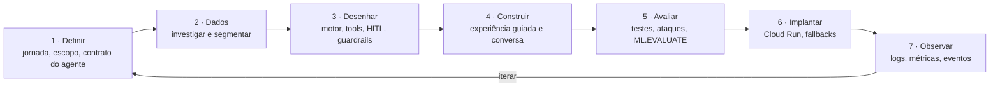

<p align="center">
  
</p>

<h1 align="center">zera.ai</h1>

<p align="center">
  <strong>Renegociação que cabe no mês da cliente.</strong><br>
  Agente de IA que lê o extrato real, calcula o que cabe com um motor determinístico e só contrata com a confirmação da cliente.<br>
  <em>O modelo explica; nunca faz conta.</em>
</p>

<p align="center">
  
  
  
  
  
  
  
</p>

<p align="center">
  <a href="https://zera-4p3fwfvm4a-uc.a.run.app/?cliente=02123dba-723a-4b1c-81da-e6ba635672fc"><strong>Demo em produção</strong></a> ·
  <a href="docs/zera.ai.mp4">Vídeo</a> ·
  <a href="docs/zera.ai%20Pitch.pdf">Pitch (PDF)</a> ·
  <a href="docs/C4-Model.html">Arquitetura C4 (apresentação)</a> ·
  <a href="docs/arquitetura-explicativa.md">Documento explicativo</a> ·
  <a href="infra/producao.md">Runbook de produção</a>
</p>

---

## Sumário

1. [O problema](#1-o-problema)
2. [A solução em cinco passos](#2-a-solução-em-cinco-passos)
3. [Princípios que valem em todo o código](#3-princípios-que-valem-em-todo-o-código)
4. [Arquitetura aplicada (C4)](#4-arquitetura-aplicada-c4)
5. [Decisões](#5-decisões)
6. [ADLC — como o agente foi construído](#6-adlc--como-o-agente-foi-construído)
7. [Dados e segmentação](#7-dados-e-segmentação)
8. [A conversa](#8-a-conversa)
9. [Estrutura do repositório](#9-estrutura-do-repositório)
10. [Rodar local](#10-rodar-local)
11. [Produção no Google Cloud](#11-produção-no-google-cloud)
12. [Observabilidade e FinOps](#12-observabilidade-e-finops)
13. [Métricas do produto](#13-métricas-do-produto)
14. [Limitações e próximos passos](#14-limitações-e-próximos-passos)
15. [Documentação](#15-documentação)
16. [Time](#16-time)

---

## 1. O problema

A Batalha de Agentes pediu uma escolha: **uma jornada real** da vida financeira do cliente, justificada com dados, e um agente que
ajude a decidir melhor no momento certo. Não chegamos com a dor escolhida. Ela saiu da base do evento.

|              |                                                                                                                                                                                              |
| ------------ | -------------------------------------------------------------------------------------------------------------------------------------------------------------------------------------------- |
| **Base**     | `hackathon_dados.extrato_sintetico` — **467.585 lançamentos**, **1.000 clientes**, jan–dez/2025                                                                                              |
| **Segmento** | k-means no BigQuery ML (k = 4). O cluster mais endividado tem **160 clientes, 16% da base**: saldo negativo crônico, renda regular — e nenhum acordo que caiba                               |
| **Persona**  | "Cleide", o cliente real mais típico do cluster (medoide): renda média R$ 8.632/mês, **11 dos 12 meses no vermelho**, R$ 7.537 no cheque especial a 8% a.m. — **R$ 603 por mês só de juros** |
| **Contexto** | 83 milhões de brasileiros negativados. A pergunta que nenhum acordo responde hoje: _"essa parcela cabe junto com as minhas outras despesas?"_                                                |

A zera.ai é o agente do Itaú que responde essa pergunta com os números da própria cliente.

## 2. A solução em cinco passos

|       Passo        | O que acontece                                                                                                                                                        | Quem faz                                    |
| :----------------: | --------------------------------------------------------------------------------------------------------------------------------------------------------------------- | ------------------------------------------- |
|  **1 · Gatilho**   | Entrada no cheque especial ou no rotativo, pré-negativação, risco de parcela, dinheiro extra. Convite discreto — só se a cliente autorizou                            | `motor/gatilhos.py`                         |
|  **2 · Entender**  | Quanto deve, quanto cresce por mês, o que sobra (renda = média das entradas do extrato; sem renda, a zera.ai pergunta)                                                | `motor/capacidade.py`, `dados/`             |
|   **3 · Opções**   | Só as que cabem: 12 a 60x a 1,8% a.m. sobre o saldo integral, custo total na frente, **hoje × nova opção no mesmo prazo**. Nada cabe? Diagnóstico numérico e caminhos | `motor/simulacao.py`, `motor/beneficios.py` |
| **4 · Confirmar**  | Nada executa sem o toque da cliente no app: HITL nativo do ADK ou botão **Contratar**. Consentimento registrado com canal, frase e hora                               | `zera_agent/tools.py`, `api/main.py`        |
| **5 · Acompanhar** | Respiro em mês apertado, amortização quando entra dinheiro, mais de um acordo, cumprimento em D+90                                                                    | `motor/`, `zera_agent/contexto.py`          |

**Ambos ganham.** O banco não abre mão do saldo: muda a taxa (8–14% a.m. → 1,8% a.m.) e o prazo (12–60x) e recebe o saldo integral
mais os juros do acordo. A cliente ganha parcela que cabe, data para terminar e nome limpo.

## 3. Princípios que valem em todo o código

| Princípio                         | Como se garante                                                                                                                                                            |
| --------------------------------- | -------------------------------------------------------------------------------------------------------------------------------------------------------------------------- |
| **O LLM nunca calcula**           | Todo número nasce em `motor/` (Python puro, testado). O guardrail de saída confere cada número do texto com os das tools da sessão; número inventado nunca chega à cliente |
| **Só a cliente contrata**         | `FunctionTool(require_confirmation=True)` no ADK ou o botão determinístico. "Sim" digitado nunca contrata                                                                  |
| **Nenhum dado mockado**           | Perfis reais da base do evento; `tests/fixtures/` é sintético e existe **só** para testes; dívidas inferidas são rotuladas "estimado do extrato"                           |
| **Sem beco sem saída**            | Toda resposta termina em próximos passos que viram botões; humano é uma saída prevista, não uma falha                                                                      |
| **Observabilidade só no backend** | Nada de tokens, custo ou selo de guardrail na interface; logs, métricas e eventos ficam no Cloud Logging, `/metrics` e BigQuery                                            |

## 4. Arquitetura aplicada (C4)

A zera.ai separa o que precisa ser **exato** do que precisa ser **compreensível**. Um único serviço no Cloud Run reúne UI, API e agente.
Dentro dele, o **motor determinístico** produz todo número, elegibilidade e termo; o **agente ADK com Gemini 3.8 Flash** entende a intenção
e explica chamando o motor por _function tools_; os **guardrails em três camadas** (entrada, tool, saída) garantem que nenhum número inventado,
promessa ou pressão chegue à cliente. Os dados vêm da base do evento via **BigQuery + BigQuery ML**, o estado é append-only e as ações com
efeito só executam com confirmação humana.

### Nível 1 — contexto

Três pessoas (cliente; atendimento humano; produto, crédito e dados), um sistema e cinco dependências gerenciadas. A cliente decide e
autoriza tudo; o atendimento humano é uma saída prevista.

<p align="center"></p>

### Nível 2 — containers

Dentro da linha tracejada, tudo roda na mesma imagem (1 instância): UI, API, orquestrador da experiência guiada, agente ADK, guardrails,
RAG leve, motor, contexto/estado, acesso a dados e observabilidade transversal. Fora, o Google Cloud faz o que é gerenciado: modelo
(Vertex AI + Model Armor), dados (BigQuery) e observabilidade (Logging/Monitoring).

<p align="center"></p>

### Um turno de conversa

Roteamento determinístico, guardrails de entrada e saída, tools do motor e opções extraídas em botões:

<p align="center"></p>

### Contratar pelo botão

Via determinística com o card de confirmação — nada passa pelo Gemini:

<p align="center"></p>

Os componentes (nível 3), o grafo do ADK, a máquina de estados e os fluxos completos estão no
[documento explicativo](docs/arquitetura-explicativa.md) (§3–§6); a versão para apresentar, com sequências, dados e decisões,
em [`docs/C4-Model.html`](docs/C4-Model.html) (abra no navegador; `→`/`←` navegam).

## 5. Decisões

As decisões que definem o produto, em uma linha cada. As tabelas completas — com alternativas consideradas, consequências e como se
verifica — estão no documento explicativo: [§7 arquitetura](docs/arquitetura-explicativa.md#7-decisões-técnicas-e-justificativas)
e [§8 dados e algoritmos](docs/arquitetura-explicativa.md#8-decisões-de-dados-e-algoritmos).

### As oito que definem a zera.ai

|  #  | Decisão                                                                     | Por quê                                                                                                  | Onde                                 |
| :-: | --------------------------------------------------------------------------- | -------------------------------------------------------------------------------------------------------- | ------------------------------------ |
| D1  | **Motor determinístico separado do LLM**; o modelo só chama tools e explica | Exatidão e auditabilidade; fórmulas com teste unitário; fecha o ciclo com o guardrail numérico           | `motor/`, `zera_agent/guardrails.py` |
| D2  | **Google ADK com HITL nativo** (`require_confirmation=True`)                | Confirmação, sessões e callbacks prontos; o mesmo agente roda no `adk web`, na API e nos testes          | `zera_agent/agent.py`, `tools.py`    |
| D3  | **Botão "Contratar" determinístico** além do HITL do modelo                 | O modelo às vezes explica em vez de agir; o botão garante o caminho sem tokens e com os números do motor | `api/main.py`                        |
| D5  | **Números válidos por sessão**, invalidados quando o estado muda            | A cliente pergunta sobre um valor de dois turnos atrás e ele continua verdadeiro até o estado mudar      | `zera_agent/guardrails.py`           |
| D7  | **Renda = média das entradas**; ausente → perguntar                         | Fonte real e explicável; imputar decidiria pela cliente                                                  | `dados/`, `motor/capacidade.py`      |
| D10 | **BigQuery + BigQuery ML** para segmentação e estado                        | Processa onde os dados estão; k-means auditável; estado append-only                                      | `dados/sql/`                         |
| D12 | **Um serviço no Cloud Run, 1 instância**                                    | Uma URL, um deploy, custo previsível; sessões do ADK em processo                                         | `infra/deploy_app.sh`                |
| A8  | **Capacidade pelo P25 da sobra** − colchão 5%, × 0,75, 2 respiros           | Conservador: a parcela cabe em 3 de 4 meses; o colchão absorve variação                                  | `motor/politicas.py`                 |

<details>
<summary><strong>Todas as decisões de arquitetura (D1–D17)</strong></summary>

<br>

|  #  | Decisão                                                              | Por quê                                                               |
| :-: | -------------------------------------------------------------------- | --------------------------------------------------------------------- |
| D1  | Motor determinístico separado do LLM                                 | Exatidão, auditabilidade, testes sobre as fórmulas                    |
| D2  | Google ADK com `FunctionTool(require_confirmation=True)`             | HITL, sessões, callbacks e tracing nativos                            |
| D3  | Botão "Contratar" determinístico além do HITL                        | Caminho de contratação garantido, sem tokens, com os números do motor |
| D4  | Roteamento determinístico antes do agente; trilha derivada das tools | UX previsível, 0 tokens; HITL só quando a cliente entra no fluxo      |
| D5  | Números válidos por sessão, invalidados por `MUTADORES_DE_ESTADO`    | Valor mostrado antes continua válido até o estado mudar               |
| D6  | Bloqueio de guardrail vira hand-off humano, sem selo na UI           | Encaminhar é saída correta; nada de linguagem técnica para a cliente  |
| D7  | Renda = média mensal das entradas; ausente → perguntar               | Fonte real e explicável                                               |
| D8  | Pergunta de gasto fixo guiada por dados (`sinais_gastos_invisiveis`) | Não perguntar o que já sabemos; a pergunta traz os números            |
| D9  | Múltiplos acordos; parcela ativa vira compromisso                    | Dívida nova ou o que ficou fora; a capacidade desconta o contratado   |
| D10 | BigQuery + BigQuery ML para segmentação e estado                     | Processa onde os dados estão; Firestore não liberado no projeto       |
| D11 | Snapshot embarcado + leitura sem job como fallbacks                  | Produção com dado real mesmo sem IAM completo; fonte sempre rotulada  |
| D12 | Um serviço no Cloud Run, 1 instância                                 | Uma URL, um deploy; sessões e cache em processo                       |
| D13 | Identidade e repositório existentes no deploy                        | O projeto do evento não permite criar SA nem repositório              |
| D14 | Observabilidade só no backend                                        | A cliente não vê tokens nem bloqueios                                 |
| D15 | Amostra local = export real; fixtures só em testes                   | Regra "nenhum dado mockado"                                           |
| D16 | `gemini-3.8-flash` no endpoint `global`, temperatura 0,2             | Latência e custo da classe Flash; família 3.x servida em `global`     |
| D17 | Base de conhecimento por palavra-chave, sem vector store             | Três arquivos curtos; zero infraestrutura; nunca fonte de números     |

</details>

<details>
<summary><strong>Todas as decisões de dados e algoritmos (A1–A16)</strong></summary>

<br>

|  #  | Decisão                                                                      | Por quê                                                             |
| :-: | ---------------------------------------------------------------------------- | ------------------------------------------------------------------- |
| A1  | Fonte única: base do evento; dívidas inferidas rotuladas                     | A jornada precisa provar-se nos casos reais                         |
| A2  | Renda = média mensal das entradas (tipo E, 12 meses)                         | Explicável para a cliente                                           |
| A3  | Classificação de transações por regras versionadas (SQL e pandas espelhados) | Auditável, idêntica nos modos BigQuery e amostra                    |
| A4  | Features proporcionais + sinais, padronizadas                                | Robustas sem renda no extrato; comparáveis entre clientes           |
| A5  | k-means++ no BigQuery ML, k = 4                                              | Roda onde os dados estão; `ML.EVALUATE`: Davies-Bouldin 1,569       |
| A6  | Cluster-alvo por índice de endividamento; persona = medoide                  | Regra explícita; "Cleide" é o cliente real mais típico              |
| A7  | Dívidas derivadas do extrato por regras                                      | O extrato é o que existe; rótulo "estimado do extrato"              |
| A8  | Capacidade pelo P25 da sobra, colchão 5%, fator 0,75, 2 respiros             | Conservador; cabe em 3 de 4 meses                                   |
| A9  | Priorização por custo mensal + consequência                                  | O que dói por mês pesa mais que a taxa nominal                      |
| A10 | Um cenário por prazo (12–60x), Price a 1,8% a.m. sobre o saldo integral      | "Ambos ganham": saldo mantido, prazos discretos são o catálogo real |
| A11 | Nada cabe → diagnóstico numérico e caminhos                                  | A cliente sai com número e opção                                    |
| A12 | Hoje × nova opção no mesmo prazo                                             | Sem prazo não existe total; comparar no mesmo prazo é honesto       |
| A13 | Gatilhos em ordem de urgência                                                | Consequência e prazo definem quem fala primeiro                     |
| A14 | Guardrail numérico: todo número do texto ∈ tools ∪ cliente ∪ gatilho         | Fecha o ciclo "o LLM nunca calcula"                                 |
| A15 | RAG leve: busca lexical top-3, sanitizada                                    | Zero infraestrutura, milissegundos, auditável                       |
| A16 | Premissas de crédito em um único arquivo (`motor/politicas.py`)              | Trocar a política não muda o motor                                  |

</details>

## 6. ADLC — como o agente foi construído

Tratamos o agente como um **produto de engenharia com ciclo de vida completo**
(_Agent Development Life Cycle_): cada fase deixa um artefato no repositório e decisões registradas, e nenhuma fase depende do modelo
de linguagem para ser verificada. Foi isso que permitiu entregar tanto em tão pouco tempo.



| Fase                      | O que fizemos                                                                                                                                                                                                                                      | Decisões                      | No repositório                                                                                              |
| ------------------------- | -------------------------------------------------------------------------------------------------------------------------------------------------------------------------------------------------------------------------------------------------- | ----------------------------- | ----------------------------------------------------------------------------------------------------------- |
| **1 · Definir**           | Escolher a jornada (negativação, 16% da base) e escrever o **contrato do agente**: o que pode (entender, simular, propor, explicar), o que não pode (calcular, prometer, pressionar, contratar sem confirmação) e quando encaminha para uma pessoa | D1 · D3 · D6 · A1             | `docs/PRD-MVP.md`, `docs/quadro-produto.md`, `docs/estrategia-dados.md`, `zera_agent/prompts.py`            |
| **2 · Dados**             | Investigar a base completa antes de construir: classes de transação por regras, features proporcionais, k-means no BigQuery ML, cluster-alvo por índice de endividamento, persona = medoide, dívidas derivadas rotuladas                           | A2 – A7                       | `dados/sql/`, `dados/segmentacao.py`, `dados/sql/ficha_segmento.sql`                                        |
| **3 · Desenhar**          | Motor determinístico separado do modelo; 16 tools com contrato tipado (3 com HITL nativo); guardrails em três camadas; RAG leve; premissas de crédito em um único arquivo                                                                          | D1 · D2 · D5 · D17 · A8 – A16 | `motor/`, `zera_agent/tools.py`, `zera_agent/guardrails.py`, `conhecimento/`, `motor/politicas.py`          |
| **4 · Construir**         | Duas vias sobre o mesmo motor: experiência guiada (contrato estruturado, 0 tokens) e conversa (ADK + Gemini); roteamento determinístico; opções viram botões; estado append-only                                                                   | D3 · D4 · D9 · D10 · D16      | `zera_agent/experiencia.py`, `zera_agent/agent.py`, `api/main.py`, `ui/`                                    |
| **5 · Avaliar**           | **101 testes sem rede** — motor, fluxo, agente com HITL (`FakeLlm`), API do chat, ataques aos guardrails, dados, conhecimento, autenticação do modelo; `ML.EVALUATE` do k-means (Davies-Bouldin 1,569; curva por k); smoke test em produção        | D5 · D14 · A5 · A14           | `tests/`, `tests/fake_llm.py`, `dados/avaliar_k.py`, `infra/smoke_prod.sh`                                  |
| **6 · Implantar**         | Um serviço no Cloud Run (imagem multi-stage), identidade e repositório existentes, fallbacks de dados (query → tabelas → snapshot), plano B com chave de API no Secret Manager, sonda do Gemini ao fim do deploy                                   | D11 · D12 · D13               | `Dockerfile`, `infra/deploy_app.sh`, `infra/gemini_api_key.sh`, `infra/producao.md`                         |
| **7 · Observar e iterar** | Logs JSON com trace id, `/metrics` (p50/p95, custo por jornada), `zera.telemetria` e `zera.eventos`, alertas e orçamento; bloqueio de guardrail vira evento, não selo na tela; métrica principal: cumprimento em D+90                              | D6 · D14                      | `zera_agent/observabilidade.py`, `infra/observabilidade.sh`, [Métricas do produto](#13-métricas-do-produto) |

**O que o ciclo muda na prática**

- **O modelo é a última camada.** Motor, experiência guiada e testes funcionam sem ele (`ZERA_FONTE=amostra`, `FakeLlm`); a conversa
  com o Gemini é uma via a mais sobre o mesmo motor, não a base do produto.
- **Todo comportamento tem um teste e todo número tem uma origem.** O guardrail numérico fecha o ciclo: o que o modelo escreve é
  conferido com o que as tools da sessão devolveram.
- **Produção faz parte do ciclo.** Deploy com sonda do modelo, smoke test, fallbacks de dados e contornos de IAM documentados —
  o serviço precisava funcionar com dado real mesmo sem permissões de administrador.

## 7. Dados e segmentação

Tudo o que a cliente vê como número nasce de um dado real e de uma fórmula testada. O modelo de linguagem não participa de nenhum passo.

<p align="center"></p>

|                   |                                                                                                                                                                                                                                                                                                  |
| ----------------- | ------------------------------------------------------------------------------------------------------------------------------------------------------------------------------------------------------------------------------------------------------------------------------------------------ |
| **Pipeline**      | `dados/sql/zera_tabelas.sql` (extrato particionado e clusterizado, classe por regras, features mensais, `perfil_cliente`, `dividas_derivadas`) → `dados/sql/clusterizacao.sql` (`features_cliente` → **k-means++ BigQuery ML**, k = 4 → `clusters_clientes` → `perfil_clusters` → `perfis_demo`) |
| **Segmento-alvo** | Cluster com maior índice de endividamento (média de z-scores): **160 clientes, 16,0%**; mediana de 10 meses no vermelho em 12; dívida inferida mediana R$ 9.467; renda mediana R$ 7.798/mês, regular (CV 0,175)                                                                                  |
| **Qualidade**     | `ML.EVALUATE`: Davies-Bouldin **1,569**, distância quadrática média 7,286. Curva por k = 2…8: `uv run python -m dados.avaliar_k`                                                                                                                                                                 |
| **Persona**       | Medoide do cluster-alvo. Hoje a parcela máxima que cabe é R$ 177 e a menor parcela possível é R$ 249 (60x): o motor devolve o **diagnóstico** (faltam R$ 72/mês; entrada de R$ 2.639 ou R$ 96/mês a menos de gastos resolvem). Outros perfis do segmento fecham acordo direto                    |
| **Ficha**         | `bq query --use_legacy_sql=false < dados/sql/ficha_segmento.sql` devolve os números da ficha "Público prioritário e persona"                                                                                                                                                                     |

<details>
<summary><strong>Fórmulas do motor</strong> (todas em <code>motor/</code>, cobertas por <code>tests/test_motor.py</code>)</summary>

<br>

| Etapa             | Fórmula                                                                                                                                   |
| ----------------- | ----------------------------------------------------------------------------------------------------------------------------------------- |
| Renda e sobra     | `renda = média(entradas tipo E, 12 meses)` · `sobra[m] = renda[m] − essenciais[m] − compromissos[m]`                                      |
| Capacidade        | `parcela_máx = 0,75 × max(0, P25(sobra) − 0,05 × renda_mediana)` · conforto = 70% se `CV(renda) ≥ 0,12` · respiros = 2                    |
| Cenário por prazo | `parcela(n) = Price(saldo_consolidado, 1,8% a.m., n)`, `n ∈ {12, 18, 24, 36, 48, 60}`                                                     |
| Viabilidade       | `parcela + mantidas ≤ parcela_máx` **e** `#{m : sobra[m] − colchão < parcela} ≤ respiros`                                                 |
| Ambos ganham      | `custo_total = entrada + n × parcela = saldo_original + juros_acordo`                                                                     |
| Hoje              | `juros/mês = Σ saldo_i × taxa_i` · `projeção(n) = Σ Price(saldo_i, taxa_i, n) × n`                                                        |
| Nada cabe         | `parcela_disp = min(parcela_máx, (respiros+1)-ésima menor sobra líquida) − mantidas` · `entrada_nec = saldo − PV(parcela_disp, 1,8%, 60)` |
| Prioridade        | `custo_mensal = saldo × taxa + peso(consequência)`                                                                                        |
| Gatilhos          | `entrada_rotativo` > `pre_negativacao` (≥ 45 dias) > `risco_parcela` (D-3) > `dinheiro_extra` (≥ 40% da renda ou 13º/IRPF/FGTS/PLR)       |

</details>

**Modo local sem credenciais** (`ZERA_FONTE=amostra`): `dados/amostra_bq_extrato_sintetico.csv` é export real (40 clientes × 12 meses)
e `dados/segmentacao.py` aplica as mesmas features com segmentação por regras.

## 8. A conversa

- **Abertura determinística** (0 tokens): contexto do gatilho, três proteções e sugestões. Cumprimentos, agradecimentos, "não fazer nada
  agora" e **"1", "2", "3" digitados** são resolvidos sem modelo, contra as últimas opções mostradas.
- **Trilha** Entender → Opções → Escolher → Confirmar no app → Acompanhar, derivada no backend das tools chamadas.
- **Cards do motor** (raio-X, capacidade, prioridades, cenários com botão **Contratar** por opção, acordo) conforme os eventos chegam:
  `etapa · tool_call · tool_result · card · texto · hitl · fim`.
- **Botões**: a enumeração final de toda resposta vira botões; "Contratar a C1" abre o card de confirmação direto; "na tela" abre a
  experiência guiada; "falar com uma pessoa" aciona `escalar_humano`.
- **Card de confirmação (HITL)**: números do motor, nunca o texto do modelo; consentimento registrado com canal (`hitl_app` / `botao_app`),
  frase e hora. Recusa → nada executa. Tudo o que acontece fora do modelo entra no histórico da sessão do ADK.
- **Depois do acordo**: status, respiro em mês apertado, amortização com dinheiro extra; o que ficou de fora abre outra jornada.

## 9. Estrutura do repositório

```text
zera.ai-itau/
├── motor/            Motor determinístico (Python puro, 0 LLM): capacidade, priorização, cenários por prazo (Price),
│                     hoje × nova opção, benefícios validados, termos/CET, acordo, respiro, amortização, gatilhos
├── dados/            Loader (bigquery | bigquery_snapshot | amostra | fixture), segmentação por regras, SQL do pipeline
│   └── sql/          zera_tabelas · clusterizacao (k-means) · exportar_amostra · ficha_segmento
├── zera_agent/       agent.py (LlmAgent), tools.py (16 tools; 3 com HITL), prompts.py, guardrails.py (4 callbacks),
│                     contexto.py (perfil + estado), experiencia.py (máquina de estados), observabilidade.py
├── conhecimento/     RAG leve: política de renegociação, FAQ e glossário (busca lexical top-3, sanitizada)
├── api/              FastAPI: /v1/clientes, experiência guiada, /chat/inicio · /chat/stream (NDJSON) · /chat/contratar ·
│                     /chat/confirmar(/stream), /health /ready /metrics, /simular_tempo, /reset — serve a UI buildada
├── ui/               App mobile (React 19 + Vite 8 + Tailwind 4): perfis → onboarding → home → experiência guiada | conversa
├── tests/            101 testes sem rede: motor, fluxo, agente com HITL, API do chat, guardrails/ataques, dados, conhecimento
├── infra/            deploy_app.sh, smoke_prod.sh, gemini_api_key.sh, conceder_dataset.py, observabilidade.sh, producao.md
├── docs/             Entregáveis: documento explicativo, C4 (apresentação), PRD, quadro de produto, pitch, vídeo, QR
├── Dockerfile        Multi-stage: build da UI + imagem da API/agente
└── pyproject.toml    Dependências (uv) — google-adk, google-cloud-aiplatform, google-cloud-bigquery, fastapi
```

## 10. Rodar local

```bash
uv sync                                   # ou: pip install -r requirements.txt
cp zera_agent/env.demo zera_agent/.env    # lido automaticamente (adk web, uvicorn, pytest); ZERA_FONTE=amostra roda sem credenciais
unset GOOGLE_CLOUD_LOCATION               # a variável do shell tem precedência sobre o .env; gemini-3.x é servido em "global"
gcloud auth application-default login     # só para a conversa com o Gemini (a experiência guiada roda sem LLM)

uv run pytest -q                          # 101 testes, sem rede
uv run uvicorn api.main:app --reload --port 8080
cd ui && npm install && npm run dev       # http://localhost:5173 — /api vai para :8080
```

Com o BigQuery publicado (`uv run python -m dados.publicar_bq`, uma vez):

```bash
ZERA_FONTE=bigquery ZERA_ESTADO=bigquery uv run uvicorn api.main:app --port 8080
```

## 11. Produção no Google Cloud

Um serviço no Cloud Run reúne API, agente e UI (projeto `batalha-time-03-vhxk`, região `us-central1`).

```bash
gcloud auth login && gcloud config set project batalha-time-03-vhxk
uv run python -m dados.publicar_bq                                        # 1x: tabelas zera.* + k-means + perfis_demo
uv run python infra/conceder_dataset.py squad-agent-sa@batalha-time-03-vhxk.iam.gserviceaccount.com
SA_NAME=squad-agent-sa ./infra/deploy_app.sh                              # Cloud Build + Cloud Run; termina com uma sonda do Gemini
./infra/smoke_prod.sh https://zera-4p3fwfvm4a-uc.a.run.app                # health, perfis, proatividade, chat, Contratar → HITL → recusa
```

| O deploy configura |                                                                                                                 |
| ------------------ | --------------------------------------------------------------------------------------------------------------- |
| Modelo             | `gemini-3.8-flash` no Vertex AI, `GOOGLE_CLOUD_LOCATION=global`, credencial = identidade do serviço             |
| Dados              | `ZERA_FONTE=bigquery` com fallback automático: query → leitura direta das tabelas → snapshot embarcado no build |
| Estado             | `ZERA_ESTADO=bigquery` (cai para JSON se recusado), append-only                                                 |
| Serviço            | 1 instância (sessões do ADK em processo), logs JSON, `ZERA_STRICT_NUMEROS=1`, `ZERA_DOCS=0`                     |

**IAM do projeto do evento.** A conta pessoal não cria service account, repositório do Artifact Registry nem altera IAM; a conta compute
padrão não tem Vertex nem BigQuery. Por isso o serviço roda com a `squad-agent-sa` (tem `roles/aiplatform.user`) e o BigQuery é liberado no
nível do dataset. Sem uma SA com Vertex, `infra/gemini_api_key.sh` sobe com chave de API no Secret Manager. Detalhes, falhas conhecidas e
rollback em [`infra/producao.md`](infra/producao.md).

## 12. Observabilidade e FinOps

Tudo no backend, nada na interface.

- **Logs JSON** com request/trace id no Cloud Logging: `http`, `chamada_llm`, `transicao`, `guardrail`.
- **`/metrics`**: p50/p95 por etapa e custo por jornada.
- **BigQuery**: `zera.telemetria` e `zera.eventos` (funil, cumprimento, bloqueios).
- **`infra/observabilidade.sh`**: métricas de log, alerta 5xx e orçamento de billing.
- **OTel → Cloud Trace** fica desligado neste projeto (Org Policy bloqueia `cloudtrace.googleapis.com`); `ZERA_OTEL_GCP=1` religa em outro.
- **Custo de referência**: experiência guiada = 0 tokens; jornada com "por que" + 2 perguntas ≈ US$ 0,002.

## 13. Métricas do produto

|                       |                                                                                                                                      |
| --------------------- | ------------------------------------------------------------------------------------------------------------------------------------ |
| **Principal**         | **Cumprimento em D+90**: acordos com parcelas vencidas integralmente pagas ÷ acordos acompanhados. A métrica é manter, não só fechar |
| **Apoio**             | Conversão, reincidência, recuperação, custo por jornada                                                                              |
| **Na voz da cliente** | Compreensão, adequação percebida, respeito e controle (perguntas curtas pós-jornada)                                                 |
| **Do agente**         | Números divergentes, respostas sem respaldo, violações de tom, falhas de tools, encaminhamentos                                      |

## 14. Limitações e próximos passos

- Contratação, débito automático e boleto são **simulados no motor** (acordo com termos e CET); a integração transacional e o Open Finance
  são o piloto.
- Sessões do ADK em memória (1 instância) → `VertexAiSessionService` / Agent Engine para escalar.
- Gatilhos calculados na leitura → scheduled query diária + Pub/Sub.
- k = 4 validado por Davies-Bouldin; estabilidade dos centróides e revisão de k ficam para o piloto.
- RAG por busca lexical → Vertex AI Search quando a base crescer.

## 15. Documentação

| Documento                                                                                                                                          | Conteúdo                                                                                                                                                        |
| -------------------------------------------------------------------------------------------------------------------------------------------------- | --------------------------------------------------------------------------------------------------------------------------------------------------------------- |
| [`docs/arquitetura-explicativa.md`](docs/arquitetura-explicativa.md)                                                                               | **Item 5 da submissão**: componentes, integrações GCP, fluxos, 17 decisões de arquitetura e 16 de dados/algoritmos com justificativas, RAI, qualidade, evolução |
| [`docs/C4-Model.html`](docs/C4-Model.html)                                                                                                         | Página para apresentar: C4 níveis 1 e 2 desenhados, um turno, diagramas de sequência, dados e algoritmos, decisões, Google Cloud                                |
| [`docs/PRD-MVP.md`](docs/PRD-MVP.md) · [`docs/quadro-produto.md`](docs/quadro-produto.md) · [`docs/estrategia-dados.md`](docs/estrategia-dados.md) | PRD, quadro único de produto (tese, outcomes, guardrails, métricas), estratégia de dados                                                                        |
| [`docs/zera.ai Pitch.pdf`](docs/zera.ai%20Pitch.pdf) · [`docs/zera.ai.mp4`](docs/zera.ai.mp4)                                                      | Pitch de 3 slides e vídeo da demo                                                                                                                               |
| [`docs/qr-zera-ai.png`](docs/qr-zera-ai.png)                                                                                                       | QR da demo em produção (perfil "Cleide")                                                                                                                        |
| [`infra/producao.md`](infra/producao.md)                                                                                                           | Runbook de produção: deploy, IAM do projeto do evento e contornos, smoke test, observabilidade, rollback                                                        |

## 16. Time

Projeto vencedor da **Batalha de Agentes** (26 e 27 de setembro de 2026, CEIC Itaú, São Paulo) — uma iniciativa Itaú em parceria com
Google Cloud e Santo Digital —, construído em dois dias com a base real do evento.

- Daniel Teixeira · [@dcdaniiel](https://github.com/dcdaniiel)
- Yasmin Mendes · [@YasminMi](https://github.com/YasminMi)
- Tathiana Scapolatieri
- Jess Messias

Mentoria: Bárbara Correia.
