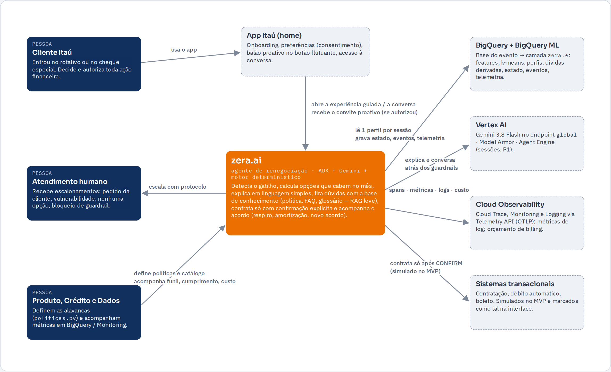
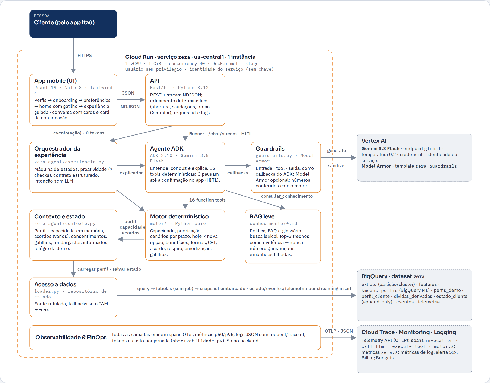
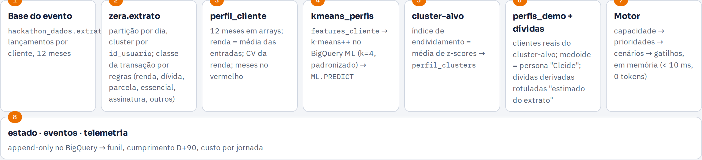
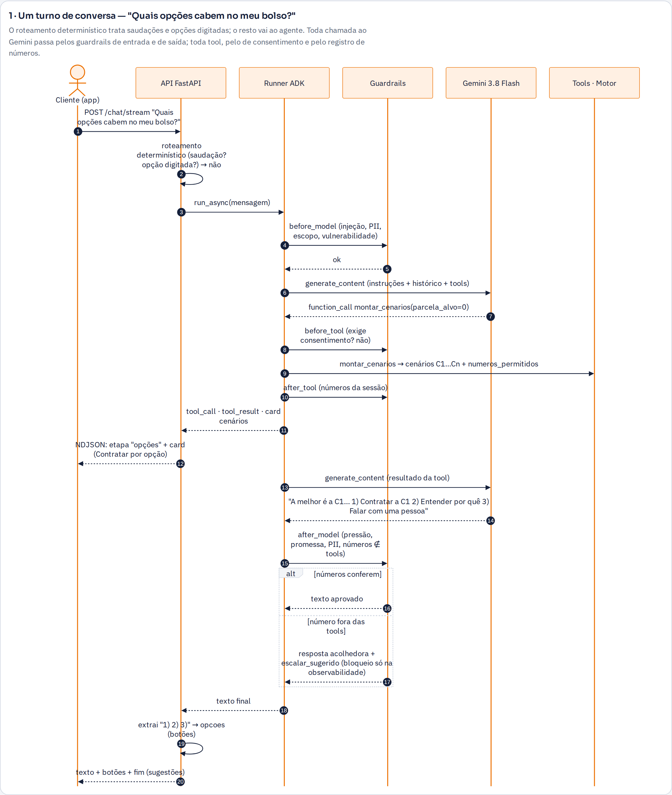
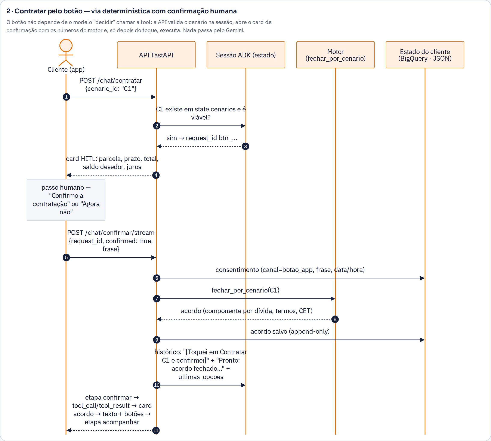

# zera.ai — renegociação que cabe no mês da cliente

Agente do Itaú (Google ADK + Gemini 3.8 Flash no Vertex AI) para a **Batalha de Agentes Itaú × Google** (26–27/09/2026, projeto GCP
`batalha-time-03-vhxk`). A cliente entra no cheque especial ou no rotativo (gatilho), recebe um convite discreto — só se autorizou —,
vê **quanto deve e quanto cresce por mês**, compara **opções calculadas por um motor determinístico** que cabem no orçamento dela e
**contrata só com confirmação explícita no app**. Princípio **"ambos ganham"**: o banco não abre mão do saldo devedor — muda a taxa
(8–14% a.m. do rotativo/cheque → 1,8% a.m. de renegociação) e o prazo (12–60x); a cliente ganha parcela que cabe e data para acabar,
o banco recebe o saldo integral mais os juros do acordo.

**Demo em produção:** `https://zera-4p3fwfvm4a-uc.a.run.app/?cliente=02123dba-723a-4b1c-81da-e6ba635672fc` (persona "Cleide";
QR em [`docs/qr-zera-ai.png`](docs/qr-zera-ai.png)). Outros perfis reais do segmento: menu do frasco (controles da demo) → trocar perfil.

## Documentação (entregáveis)

| Documento | Conteúdo |
|---|---|
| [`docs/arquitetura-explicativa.md`](docs/arquitetura-explicativa.md) | **Item 5 da submissão**: componentes, integrações GCP, fluxos, 17 decisões de arquitetura e 16 de dados/algoritmos com justificativas, RAI, qualidade, evolução |
| [`docs/arquitetura-c4-apresentacao.html`](docs/arquitetura-c4-apresentacao.html) | Página para apresentar: C4 níveis 1 e 2 desenhados, um turno, **diagramas de sequência**, dados e algoritmos (fórmulas, qualidade do k-means), decisões, Google Cloud. Abra no navegador; `→`/`←` navegam |
| [`docs/arquitetura-c4.md`](docs/arquitetura-c4.md) | C4 completo (níveis 1–4, Mermaid), grafo do ADK, sequências, pipeline de dados, observabilidade/FinOps, uso de cada serviço GCP |
| [`docs/PRD-MVP.md`](docs/PRD-MVP.md) · [`docs/quadro-produto.md`](docs/quadro-produto.md) · [`docs/estrategia-dados.md`](docs/estrategia-dados.md) | PRD, quadro único de produto (tese, outcomes, guardrails, métricas), estratégia de dados |
| [`infra/producao.md`](infra/producao.md) | Runbook de produção: deploy, IAM do projeto do evento e contornos, smoke test, observabilidade, rollback |

## Arquitetura aplicada (C4)

A zera.ai separa em camadas o que precisa ser **exato** do que precisa ser **compreensível**. Um único serviço no Cloud Run reúne a UI, a API
e o agente; dentro dele, o **motor determinístico** (Python puro) produz todo número, elegibilidade e termo, o **agente ADK com Gemini 3.8 Flash**
entende a intenção e explica chamando o motor por *function tools*, e os **guardrails em três camadas** (entrada, tool, saída) garantem que
nenhum número inventado, promessa ou pressão chegue à cliente. Os dados vêm da base do evento via **BigQuery + BigQuery ML** (k-means), o
estado do cliente é append-only e a observabilidade fica no backend. As ações com efeito — contratar, respiro, amortizar — só executam com a
confirmação humana no app (HITL nativo do ADK ou botão determinístico).

**Nível 1 — contexto.** Três pessoas (cliente; atendimento humano; produto, crédito e dados), um sistema e cinco dependências. A cliente decide e
autoriza tudo; o atendimento humano é uma saída prevista, não uma falha.



**Nível 2 — containers.** Dentro da linha tracejada, tudo roda na mesma imagem (1 instância): UI, API, orquestrador da experiência guiada, agente
ADK, guardrails, RAG leve, motor, contexto/estado, acesso a dados e observabilidade transversal. Fora, o Google Cloud faz o que é gerenciado:
modelo (Vertex AI + Model Armor), dados (BigQuery) e observabilidade (Logging/Monitoring).



Níveis 3 e 4 (componentes do motor e do agente, máquina de estados, grafo do ADK) estão em [`docs/arquitetura-c4.md`](docs/arquitetura-c4.md);
a versão para apresentar, com sequências e decisões, em [`docs/arquitetura-c4-apresentacao.html`](docs/arquitetura-c4-apresentacao.html).

**Princípios que o desenho aplica**

- **O LLM nunca calcula.** Capacidade, prioridades, cenários, termos, acordo, respiro, amortização e gatilhos nascem em `motor/` (Python puro,
  testado). O Gemini entende a intenção, conduz e explica; todo número do texto é conferido com os das tools da sessão pelo guardrail de saída —
  número inventado nunca chega à cliente (ela recebe uma mensagem acolhedora com "falar com uma pessoa" em primeiro lugar).
- **Só a cliente contrata.** Na experiência guiada, só a ação `CONFIRM`; na conversa, o card de confirmação (HITL nativo do ADK —
  `FunctionTool(require_confirmation=True)` — ou o botão **Contratar** de cada opção, via determinística). "Sim" digitado nunca contrata.
- **Nenhum dado mockado.** Perfis reais da base do evento segmentados por k-means no BigQuery ML; renda = média mensal das entradas do
  extrato; sem renda no histórico o motor **não calcula** e a zera.ai pergunta. Dívidas inferidas do extrato ficam rotuladas "estimado do extrato".
- **Sem beco sem saída.** Toda resposta termina com próximos passos que viram **botões**; "nenhuma opção cabe" traz diagnóstico numérico e caminhos;
  humano é uma saída prevista (pedido, vulnerabilidade, bloqueio de guardrail).

## Dados e segmentação (base completa, direto do BigQuery)

| | |
|---|---|
| Base | `hackathon_dados.extrato_sintetico`: **467.585 lançamentos**, **1.000 clientes**, **jan–dez/2025** (35.077 entradas, 432.508 saídas) |
| Pipeline | `dados/sql/zera_tabelas.sql` (extrato particionado/clusterizado, classe por regras, features mensais, `perfil_cliente` com 12 meses em arrays, `dividas_derivadas`) → `dados/sql/clusterizacao.sql` (`features_cliente` → **k-means++ BigQuery ML**, k = 4, features padronizadas → `clusters_clientes` → `perfil_clusters` → `perfis_demo`) |
| Segmento-alvo | cluster com maior índice de endividamento (média de z-scores): **160 clientes, 16,0% da base**; mediana de 10 meses no vermelho em 12; dívida inferida mediana R$ 9.467 (141 dos 160 no cheque especial); renda média das entradas mediana R$ 7.798/mês, regular (CV 0,175) |
| Qualidade | `ML.EVALUATE`: Davies-Bouldin **1,569**, distância quadrática média 7,286 (k = 4). Curva por k = 2…8: `uv run python -m dados.avaliar_k` (grava `zera.kmeans_avaliacao`, `docs/davies_bouldin.svg` e injeta o gráfico na apresentação) |
| Persona | medoide do cluster-alvo = "Cleide": renda média R$ 8.632/mês, 11 meses no vermelho, cheque especial R$ 7.537 a 8% a.m. + crediário R$ 1.568 em 4x sem juros — R$ 603/mês só de juros. Hoje a parcela máxima que cabe é R$ 177 e a menor parcela possível é R$ 249 (60x): o motor devolve o **diagnóstico** (faltam R$ 72/mês; entrada de R$ 2.639 ou R$ 96/mês a menos de gastos resolvem) — o 13º (relógio da demo → dez/26) muda o quadro. Outros perfis do segmento fecham acordo direto |
| Ficha | `bq query --use_legacy_sql=false < dados/sql/ficha_segmento.sql` devolve todos os números da ficha "Público prioritário e persona" |



Modo local sem credenciais (`ZERA_FONTE=amostra`): `dados/amostra_bq_extrato_sintetico.csv` é export real (40 clientes × 12 meses,
`dados/sql/exportar_amostra.sql`, rode por stdin) e `dados/segmentacao.py` aplica as mesmas features com **segmentação por regras**
(ranking pelo índice; sem fronteira de cluster). `tests/fixtures/` é sintético e **só** para testes.

## Estrutura

```
motor/          capacidade (P25 da sobra − colchão 5%, × 0,75), priorização, cenários por prazo (Price 1,8% a.m.), hoje × nova opção, benefícios
                validados, termos/CET, acordo, respiro, amortização, gatilhos, sinais de gasto invisível — Python puro, 0 LLM
dados/          loader (bigquery | bigquery_snapshot | amostra | fixture), segmentação por regras, SQL (tabelas, k-means, amostra, ficha),
                publicar_bq.py, exportar_snapshot_bq.py, avaliar_k.py
zera_agent/     agent.py (LlmAgent; multiagente opcional), tools.py (16 tools; 3 com HITL nativo), prompts.py, guardrails.py (4 callbacks),
                contexto.py (perfil + estado resiliente: BigQuery → JSON), experiencia.py (máquina de estados), observabilidade.py
conhecimento/   RAG leve: política de renegociação, FAQ, glossário (busca lexical top-3, sanitizada) — tool consultar_conhecimento
api/            FastAPI: /v1/clientes (perfis do BQ), experiência guiada (contrato estruturado), /chat/inicio · /chat/stream (NDJSON) ·
                /chat/contratar · /chat/confirmar(/stream), /health /ready /metrics, /simular_tempo, /reset — serve a UI buildada
ui/             app mobile (React 19 + Vite 8 + Tailwind 4): perfis → onboarding → preferências → home (balão) → experiência guiada | conversa
tests/          101 testes sem rede (motor, fluxo, agente com HITL, API do chat, guardrails/ataques, dados, conhecimento, autenticação do LLM)
infra/          deploy_app.sh, smoke_prod.sh, gemini_api_key.sh, conceder_dataset.py, observabilidade.sh, setup_gcp.sh, producao.md
docs/           entregáveis (acima) + QR da demo
```

## Rodar local

```bash
uv sync                                   # ou: pip install -r requirements.txt
cp zera_agent/env.demo zera_agent/.env    # lido automaticamente (adk web, uvicorn, pytest); ZERA_FONTE=amostra roda sem credenciais
unset GOOGLE_CLOUD_LOCATION               # variável do shell tem precedência sobre o .env; gemini-3.x é servido em "global"
gcloud auth application-default login     # só para a conversa com o Gemini (a experiência guiada roda sem LLM)
uv run pytest -q                          # 101 testes, sem rede
uv run uvicorn api.main:app --reload --port 8080
cd ui && npm install && npm run dev       # http://localhost:5173 — /api vai para :8080
```

Com o BigQuery publicado (`uv run python -m dados.publicar_bq`, 1x): `ZERA_FONTE=bigquery ZERA_ESTADO=bigquery uv run uvicorn api.main:app --port 8080`.

## A conversa (chat) — o que a banca vê

- **Abertura determinística** (0 tokens): contexto do gatilho, três proteções e sugestões. Cumprimentos, agradecimentos e "não fazer nada agora"
  são respondidos sem modelo; **"1", "2", "3" digitados** são resolvidos contra as últimas opções mostradas, também sem modelo.
- **Trilha** Entender → Opções → Escolher → **Confirmar no app** → Acompanhar, derivada no backend das tools chamadas; só avança quando a cliente pede.
- **Cards do motor** (raio-X, capacidade, prioridades, cenários com botão **Contratar** por opção — "melhor para você" destacada —, acordo) conforme os
  eventos chegam (`etapa · tool_call · tool_result · card · texto · hitl · fim`).
- **Botões**: a enumeração final de toda resposta ("1) … 2) …") vira botões; "Contratar a C1" abre o card de confirmação direto; "na tela" abre a
  experiência guiada; "falar com uma pessoa" aciona `escalar_humano`.
- **Card de confirmação (HITL)**: números do motor, nunca o texto do modelo; consentimento registrado com canal (`hitl_app` / `botao_app`), frase e hora.
  Recusa → nada executa. Tudo o que acontece fora do modelo (botão, respostas roteadas) entra no histórico da sessão do ADK.
- **Mais de um acordo**: o que ficou de fora (ou uma dívida nova) abre outra jornada; a parcela contratada vira compromisso fixo. Depois do acordo:
  status, respiro em mês apertado, amortização com dinheiro extra.
- Nada de tokens, custo ou selo de guardrail na interface: observabilidade só no backend.

**Um turno de conversa** — roteamento determinístico, guardrails de entrada e saída, tools do motor, opções extraídas em botões:



**Contratar pelo botão** — via determinística com o card de confirmação (nada passa pelo Gemini):



## Produção (Cloud Run, um serviço: API + agente + UI)

```bash
gcloud auth login && gcloud config set project batalha-time-03-vhxk
uv run python -m dados.publicar_bq                    # 1x: tabelas zera.* + k-means + perfis_demo
uv run python infra/conceder_dataset.py squad-agent-sa@batalha-time-03-vhxk.iam.gserviceaccount.com   # BigQuery ao vivo para a identidade de runtime
SA_NAME=squad-agent-sa ./infra/deploy_app.sh          # Cloud Build (Dockerfile multi-stage) + Cloud Run; termina com uma sonda do Gemini
./infra/smoke_prod.sh https://zera-4p3fwfvm4a-uc.a.run.app   # health/ready, perfis, proatividade, chat com Gemini, botão Contratar → HITL → recusa
```

O que o deploy configura: `gemini-3.8-flash` no Vertex AI (`GOOGLE_CLOUD_LOCATION=global`, credencial = identidade do serviço), `ZERA_FONTE=bigquery`
com fallback automático (query → leitura direta das tabelas → snapshot embarcado no build), `ZERA_ESTADO=bigquery` (cai para JSON se recusado),
`ZERA_STRICT_NUMEROS=1`, 1 instância (sessões do ADK em processo), logs JSON, `ZERA_DOCS=0`. **IAM do projeto do evento**: a conta pessoal não
cria service account, repositório do Artifact Registry nem altera IAM; a conta compute padrão não tem Vertex nem BigQuery — por isso o serviço roda
com a **`squad-agent-sa`** (tem `roles/aiplatform.user`) e o BigQuery é liberado no nível do dataset. Sem uma SA com Vertex, `infra/gemini_api_key.sh`
sobe com chave de API no Secret Manager. Detalhes e falhas conhecidas em [`infra/producao.md`](infra/producao.md).

## Observabilidade e FinOps (backend)

Logs JSON com request/trace id no Cloud Logging (`http`, `chamada_llm`, `transicao`, `guardrail`); `/metrics` com p50/p95 por etapa e custo por
jornada; `zera.telemetria` e `zera.eventos` no BigQuery (funil, cumprimento, bloqueios); métricas de log, alerta 5xx e orçamento de billing em
`infra/observabilidade.sh`. OTel para o Cloud Trace fica desligado neste projeto (Org Policy bloqueia `cloudtrace.googleapis.com`); `ZERA_OTEL_GCP=1`
religa em outro projeto. Referência de custo: experiência guiada = 0 tokens; jornada com "por que" + 2 perguntas ≈ US$ 0,002.

## Métricas do produto

Principal: **cumprimento em D+90** (acordos com parcelas vencidas integralmente pagas ÷ acordos acompanhados). Apoio: conversão, reincidência,
recuperação, custo por jornada; para a cliente: compreensão, adequação percebida, respeito e controle (perguntas curtas pós-jornada). Monitoramento
do agente: números divergentes, respostas sem respaldo, violações de tom, falhas de tools, encaminhamentos.

## Limitações e próximos passos

Contratação, débito automático e boleto são simulados no motor (acordo com termos e CET) — a integração transacional e o Open Finance são o piloto.
Sessões do ADK em memória (1 instância) → `VertexAiSessionService`/Agent Engine para escala. Gatilhos calculados na leitura → scheduled query
diária + Pub/Sub. k = 4 validado por Davies-Bouldin; estabilidade dos centróides e revisão de k ficam para o piloto. RAG por busca lexical →
Vertex AI Search quando a base crescer.
