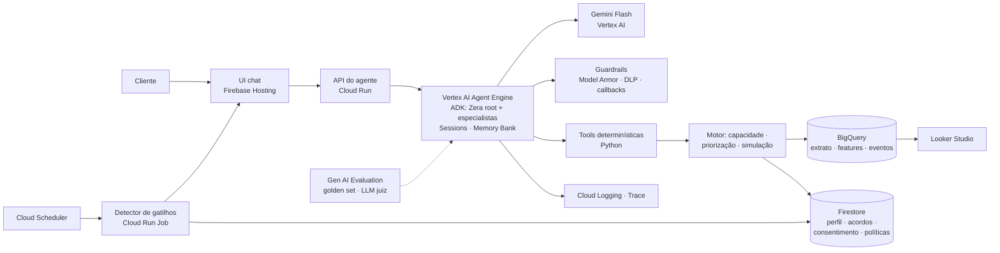

# Zera — PRD do MVP (demo) · Batalha de Agentes Itaú × Google

| | |
|---|---|
| **Agente** | Zera (nome assumido pelo repositório; troque se o time escolher outro) |
| **Jornada** | Renegociação de dívidas — "um acordo que cabe no seu mês e que você cumpre até o fim" |
| **Versão** | 0.2 · 26/09/2026 · números validados pelo motor (`tests/`) · projeto GCP `batalha-time-03-vhxk` (us-central1) |
| **Escopo deste doc** | O mínimo que a demo de 5 min precisa provar + a solução de engenharia em GCP/Gemini para construir hoje |
| **Restrição de plataforma** | Camada de agentes 100% GCP/Gemini (ADK + Vertex AI Agent Engine + Gemini). Nenhum LLM ou orquestrador de terceiros. |

> Convenção: **P0** = tem que existir para a demo · **P1** = faz hoje à noite se der · **P2** = só no slide de arquitetura ("próximo passo"). Os números da persona saem do motor (`uv run pytest -q` reproduz todos); o LLM só cita o que as tools devolvem.

---

## 0. TL;DR

Zera transforma várias dívidas em **um único plano dimensionado pela sobra real** do cliente — parcela que ele consegue pagar até o fim, prioridade pelo custo, "mês de respiro" previsto e acompanhamento até limpar o nome.

A demo prova três coisas em 5 minutos:

1. **Diagnóstico em uma tela** — quanto da renda já está comprometida, qual dívida custa mais, o que pagar primeiro.
2. **Parcela que cabe** — calculada por motor determinístico a partir do extrato (não pelo LLM), com respiro previsto; contraste com a renegociação padrão que quebraria.
3. **Execução e acompanhamento** — fecha o acordo com consentimento, aciona o respiro num mês fraco e usa dinheiro extra para quitar mais rápido.

Arquitetura: **ADK + Gemini Flash no Vertex AI Agent Engine** (Sessions + Memory Bank) → tools determinísticas em Python → **BigQuery** (extrato/features/eventos) + **Firestore** (perfil, acordos, consentimento, políticas) → guardrails (**Model Armor** + callbacks: PII, números, consentimento, vulnerabilidade) → gatilhos proativos (**Cloud Scheduler + Cloud Run Job**) → UI chat em **Firebase Hosting** → **Looker Studio** + **Gen AI Evaluation** para medir.

### Status do código (26/09, 15h)

| Pronto no repo | Falta |
|---|---|
| `motor/` completo e testado (capacidade, priorização, planos A/B/C + padrão, acordo, respiro, amortização, gatilhos) | Rodar o agente com Gemini real no projeto (`adk web` após `gcloud auth application-default login`) |
| `dados/` — extrato sintético da Cleide (315 lançamentos, 12 meses) + loader CSV/BigQuery + SQL de features/eventos | Mapear as colunas reais de `hackathon_dados.extrato_sintetico` em `dados/loader.py` e `dados/sql/features.sql` |
| `zera_agent/` — agente ADK 2.x (único ou multiagente), 13 tools, prompt, callbacks de guardrail, contexto com relógio de simulação | UI com cards (Firebase Hosting) consumindo `api/main.py` |
| `tests/` — 15 testes, incluindo o fluxo do agente com modelo falso (consentimento, números, PII, gatilhos) | `infra/setup_gcp.sh` + deploy (Agent Engine ou Cloud Run); Firestore (`ZERA_FIRESTORE=1`) |

---

## 1. Objetivo do MVP e critérios de sucesso da demo

**Pergunta que a demo responde:** "Como um agente de IA faz uma pessoa endividada fechar um acordo que ela consegue cumprir — e sustenta isso até o nome limpo?"

O MVP está pronto quando, com a persona Cleide carregada:

| # | Critério | Como verificamos |
|---|---|---|
| S1 | O agente responde "quanto eu devo?" com o raio-X consolidado (total, custo/mês, ordem de prioridade) usando **apenas** números vindos das tools | Guardrail de números passa (0 valores fora do JSON das tools) |
| S2 | Apresenta 3 planos, todos com parcela ≤ parcela máxima calculada, e explica em linguagem simples por que cabe | Teste unitário do motor + leitura da resposta |
| S3 | Fecha o acordo só depois de consentimento explícito e registra o consentimento | Documento em `consentimentos/` com timestamp e frase do cliente |
| S4 | Ao "avançar o tempo" para um mês fraco, o agente aciona proativamente o respiro em D-3 | Gatilho `risco_parcela` gerado pelo detector, conversa iniciada pelo agente |
| S5 | Ao "avançar o tempo" para a entrada de dinheiro extra, propõe quitação/amortização preservando reserva | Gatilho `dinheiro_extra` + simulação com `dinheiro_extra` |
| S6 | Demo roda ponta a ponta em < 3 min sem intervenção manual; existe vídeo de backup | Ensaio cronometrado + vídeo gravado |

Pesos da banca: Arquitetura/Eng/Dados **50%**, Negócio **30%**, Design **20%**. A demo gasta ~40% do tempo na conversa e ~35% na arquitetura e guardrails — é onde está metade da nota.

---

## 2. Persona e cenário da demo (dados fictícios)

**Cleide Souza, 52, diarista, São Paulo.** Renda irregular entre R$ 1.750 e R$ 2.700/mês (mediana ≈ R$ 2.325). Três dívidas em três canais do próprio Itaú; cobranças chegam separadas (SMS, app, telefone). Quebrou um acordo em 2025 no 3º mês porque a parcela não cabia. Tem medo de renegociar de novo. Não tem reserva.

**Dívidas (base fictícia):**

| Dívida | Saldo | Custo | Situação | Consequência |
|---|---|---|---|---|
| Cartão — rotativo | R$ 3.200 | ≈ 14% a.m. → ≈ R$ 448/mês | 2 ciclos no rotativo (≈ 60 dias) | maior custo; negativação próxima |
| Cheque especial | R$ 900 | ≈ 8% a.m. → ≈ R$ 72/mês | usado há 20 dias | custo alto contínuo |
| Empréstimo pessoal | R$ 2.700 | ≈ 4,5% a.m. → ≈ R$ 122/mês | 2 parcelas de R$ 380 atrasadas (≈ 60 dias) | negativação iminente |
| **Total** | **R$ 6.800** | **≈ R$ 640/mês só de juros** | | |

**Caixa (12 meses de extrato simulado):** despesas essenciais medianas ≈ R$ 1.550 (aluguel 700, contas 190, mercado 460, transporte 150, celular 50). Sobra mensal (renda − essenciais) varia de R$ 200 (janeiro) a R$ 1.150 (dezembro); meses fracos: jan e jul.

**A conta que o agente mostra (saída do motor, `tests/test_motor.py`):** sobra segura R$ 476,25 → parcela máxima R$ 357,19; a dívida cresce R$ 641,50/mês. *"Matematicamente não fecha sem renegociar — e a renegociação padrão (12x R$ 573,55) não caberia em 4 dos últimos 12 meses, como em 2025."*

**Gatilhos usados na demo:** (1) reativo — "quanto eu devo?"; (2) pós-acordo — D-3 em mês fraco → respiro; (3) dinheiro extra — restituição do IR ≈ R$ 1.400 → amortização com desconto. O gatilho proativo pré-negativação aparece só como banner na tela inicial (P1).

---

## 3. Escopo

### Dentro (P0 — a demo depende disso)
- Base do extrato simulado carregada e normalizada para o schema canônico (seção 9.1); persona Cleide como `cliente_id = cli_001`.
- Motor determinístico: capacidade de pagamento, priorização de dívidas, simulação de planos (à vista / parcela que cabe / parcela + respiro), amortização com dinheiro extra.
- Agente Zera (ADK + Gemini Flash) com as tools da seção 8.3, prompt da seção 8.4 e callbacks de guardrail (PII, números, consentimento).
- Registro de consentimento e do acordo (Firestore ou arquivo local no P0).
- "Relógio de simulação": avançar meses para disparar `risco_parcela` e `dinheiro_extra`.
- Interface de chat (mínimo: `adk web`; alvo: chat web próprio, seção 8.6).

### Dentro (P1 — hoje à noite)
- Deploy no Vertex AI Agent Engine (Sessions + Memory Bank) — fallback Cloud Run.
- BigQuery com views de features + tabela de eventos; Looker Studio com 4 métricas.
- Detector de gatilhos como Cloud Run Job + Cloud Scheduler.
- UI própria com cards (raio-X, planos, progresso do acordo) e banner de gatilho.
- Sub-agentes especialistas (Diagnóstico / Negociador / Acompanhamento) como `sub_agents` do root.

### Fora do MVP (P2 — só no slide "próximos passos")
- Open Finance (dívidas em outras instituições) — conector mock na arquitetura, consentimento via Open Finance BR.
- Integração real com motores de cobrança/renegociação do banco; políticas de desconto reais.
- Áudio (Cloud Text-to-Speech / Gemini Live), WhatsApp como canal.
- Portabilidade de crédito de outros bancos.

### Não-objetivos
- Educação financeira genérica, dicas, "assistente financeiro que responde tudo". O Zera só atua na jornada de renegociação e no acompanhamento do acordo.

---

## 4. Roteiro da demo (5 min)

| Tempo | Tela | O que acontece / fala do agente |
|---|---|---|
| 0:00–0:40 | Slide | Problema em 1 frase + 2 evidências (83,3 mi negativados; acordos dimensionados pela dívida quebram). Persona Cleide. |
| 0:40–1:00 | Chat | Cleide: "quanto eu devo?" → **Zera** chama `get_perfil_financeiro` + `priorizar_dividas`. Card **Raio-X**: 3 dívidas, R$ 6.800, "cresce R$ 641,50/mês", ordem: cartão (R$ 448/mês) → empréstimo (2 parcelas atrasadas, risco de negativação) → cheque especial (custo + consequência). |
| 1:00–1:30 | Chat | Zera: *"Olhei seus últimos 12 meses. Depois das contas essenciais sobra em média R$ 775, mas em janeiro e julho sobra bem menos. Por isso a parcela segura pra você é até R$ 357 — e o plano já prevê 2 meses de respiro por ano."* (`calcular_capacidade`) |
| 1:30–2:15 | Chat | Card **Planos** (`simular_planos`): **A** à vista R$ 5.440 (20% de desconto; só se entrar dinheiro extra — "eu te aviso"); **B** 21x R$ 349,49 (precisaria de respiro em 3 meses); **C** 25x R$ 301,94 com 2 respiros/ano (parcela menor para os 2 meses fracos caberem). Contraste: *"a renegociação padrão seria 12x R$ 573,55 — acima da sua sobra em 4 dos últimos 12 meses."* Cleide escolhe C (recomendado pelo motor). Zera pede confirmação explícita → botão **Aceitar** → `registrar_consentimento` → `fechar_acordo`. Card **Acordo ativo** (0/25, 1ª parcela 10/10/2026). |
| 2:15–2:45 | Chat | **Avançar tempo → janeiro/27 (mês fraco), D-3.** Gatilho `risco_parcela`. Zera inicia: *"Janeiro está apertado: previsão de sobra R$ 200 e a parcela de R$ 301,94 vence em 3 dias. Quer usar 1 dos seus 2 respiros? A parcela vai pro fim, sem juros nem mora."* → aceita (`acionar_respiro`). Progresso 3/25 pagas · 1 respiro usado · próximo vencimento 10/02. |
| 2:45–3:15 | Chat | **Avançar tempo → maio/27.** Gatilho `dinheiro_extra` (restituição do IR R$ 1.400). Zera: *"Entrou R$ 1.400 de restituição. Sugestão: R$ 1.051,25 abatem R$ 1.236,76 do saldo (desconto de amortização de 15%) e faltam 13 parcelas em vez de 18; os R$ 348,75 ficam como sua primeira reserva, porque hoje um imprevisto quebraria o acordo. Quer assim, tudo no acordo, ou guardar tudo?"* → aceita (7 pagas, 1 respiro, saldo cai de R$ 4.732,08 para R$ 3.495,32). |
| 3:15–4:15 | Slide | Arquitetura (seção 7) + guardrails: números só das tools, parcela ≤ sobra por construção, consentimento por ação, PII redigida, escalonamento humano, LGPD. Memória do cliente (Memory Bank) e estratégia de experimentação (holdout / A-B). |
| 4:15–5:00 | Slide | Métricas (seção 10) e impacto: menos reincidência, nome limpo mais rápido, menos juros pagos. Fecho: *"O banco ganha um cliente que paga até o fim; a Cleide ganha o mês de volta."* |

Backup obrigatório: vídeo da demo gravado (QuickTime/Loom) e modo `DEMO_OFFLINE=1` que responde com as mesmas tools sem rede (seção 12).

---

## 5. Requisitos funcionais

| ID | Requisito | Prioridade |
|---|---|---|
| RF-01 | Consolidar dívidas, renda e despesas do cliente a partir do extrato simulado (Itaú); Open Finance como conector mock | P0 |
| RF-02 | Calcular **capacidade de pagamento** (sobra segura, parcela máxima, meses fracos, nº de respiros) com motor determinístico e campos de explicabilidade | P0 |
| RF-03 | **Priorizar dívidas** por custo (taxa mensal × saldo) e consequência (negativação, corte de serviço, garantia) | P0 |
| RF-04 | **Simular planos** (à vista com desconto, parcela que cabe, parcela + respiro) com parcela ≤ parcela máxima, prazo ≤ 48 meses, CET e custo total explícitos; política de desconto por faixa de atraso parametrizada | P0 |
| RF-05 | Exibir **contraste** com a renegociação padrão (prazo fixo) e o motivo de ela não caber | P0 |
| RF-06 | **Registrar consentimento** explícito (frase do cliente ou botão, timestamp, plano) antes de `fechar_acordo` | P0 |
| RF-07 | **Fechar acordo** e manter estado (`proposto → aceito → ativo → quitado/quebrado`), progresso e respiros usados | P0 |
| RF-08 | **Gatilhos proativos**: `pre_negativacao` (2ª parcela atrasada ou 2º ciclo de rotativo), `risco_parcela` (D-3 com saldo previsto < parcela), `dinheiro_extra` (crédito atípico ≥ 40% da renda mediana ou categoria 13º/IR/FGTS) | P0 (via relógio de simulação) / P1 (Scheduler) |
| RF-09 | **Respiro**: adiar parcela para o fim do prazo, sem mora, até o limite previsto no acordo, sempre com consentimento | P0 |
| RF-10 | **Dinheiro extra**: propor amortização/quitação com desconto preservando reserva mínima (nunca zera a folga) | P0 |
| RF-11 | **Memória do cliente** entre sessões: preferências (dia de pagamento, canal), decisões, respiros usados, histórico do acordo | P1 (Memory Bank) / P0 (Firestore) |
| RF-12 | **Escalonar para humano** em sinal de vulnerabilidade, pedido do cliente ou quando nenhum plano cabe (então prioriza só a dívida mais cara) | P0 (tool) |
| RF-13 | Cards na UI: raio-X, planos, acordo/progresso, banner de gatilho | P1 |
| RF-14 | Log de eventos (`diagnostico_visto`, `plano_proposto`, `acordo_fechado`, `respiro_acionado`, `amortizacao`, `escalado_humano`) em BigQuery com variante de experimento | P1 |

---

## 6. Guardrails e requisitos não funcionais

| ID | Requisito | Implementação |
|---|---|---|
| RNF-01 | **Camada de agentes só GCP/Gemini**: ADK + Vertex AI Agent Engine + modelos Gemini | Sem SDKs de outros provedores no `pyproject` |
| RNF-02 | **O LLM nunca calcula**: todo valor em R$, taxa, prazo e data vem de tool | Prompt + `after_model_callback` que extrai `R$ x` da resposta e valida contra o JSON da última tool; se falhar, reescreve com a lista de valores permitidos e registra `alucinacao_numerica` |
| RNF-03 | **Parcela ≤ parcela máxima por construção** | `simular_planos` não retorna plano que viole; se nenhum cabe → `escalar_humano` |
| RNF-04 | **Consentimento por ação** | `before_tool_callback` bloqueia `fechar_acordo`, `acionar_respiro`, `amortizar` sem `state["consentimento"][acao]` registrado nesta sessão |
| RNF-05 | **Minimização de dados**: o agente recebe agregados (renda P25, essenciais, sobra), nunca a lista de transações; IDs pseudonimizados | Tools devolvem features; extrato bruto fica no BigQuery |
| RNF-06 | **PII redigida** em prompt e logs | Sensitive Data Protection (DLP) no `before_model_callback` e no export de logs; Model Armor para prompt injection/jailbreak quando habilitado no projeto |
| RNF-07 | **LGPD**: base legal e finalidade explícitas, consentimento versionado, direito de revogar ("esquecer"), retenção definida | Coleção `consentimentos/` (escopo, versão, timestamp); tool `revogar_consentimento` apaga memória do cliente |
| RNF-08 | **Vulnerabilidade**: sinais de desespero, doença, luto, ameaça de cobrança → tom de acolhimento + `escalar_humano`; nunca pressão de cobrança | Classificador leve (regex + Gemini Flash-Lite) no `before_model_callback` |
| RNF-09 | **Transparência**: sempre mostrar custo total, CET e o que muda; nunca esconder a opção "não fazer nada agora / falar com pessoa" | Regras de prompt + cards |
| RNF-10 | **Observabilidade**: trace por turno (tools chamadas, latência, tokens), métricas de guardrail | Cloud Logging + Cloud Trace (OpenTelemetry do ADK) |
| RNF-11 | **Determinismo da demo**: temperatura ≤ 0,3, seed fixa nos dados, modo offline | Config do modelo + `DEMO_OFFLINE` |
| RNF-12 | **Latência**: < 4 s por turno com tool | Gemini Flash; tools em memória; features pré-calculadas |

---

## 7. Arquitetura GCP/Gemini



### 7.1 Serviços e papel de cada um

| Camada | Serviço GCP | Papel no MVP | Prioridade |
|---|---|---|---|
| Modelo | **Gemini Flash** (o mais recente habilitado no projeto; hoje a família 3.x) via Vertex AI | Conversa, explicação em linguagem simples, escolha de tools | P0 |
| Modelo | **Gemini Flash-Lite** | Classificação em lote de descrições de transações ambíguas; classificador de vulnerabilidade | P1 |
| Agentes | **Agent Development Kit (ADK, Python)** | Orquestração, tools, callbacks, sub-agentes, `adk web` para testar | P0 |
| Agentes | **Vertex AI Agent Engine** | Runtime gerenciado; **Sessions** (estado da conversa) e **Memory Bank** (memória de longo prazo do cliente) | P1 (P0 = `InMemorySessionService` local) |
| Segurança | **Model Armor** | Filtro de prompt injection, jailbreak e dados sensíveis na entrada/saída | P1 (se habilitado; senão callbacks) |
| Segurança | **Sensitive Data Protection (DLP)** | Redação de PII em prompts e logs | P1 |
| Compute | **Cloud Run** | API do agente (fallback ao Agent Engine), UI backend, Job do detector de gatilhos | P1 |
| Agendamento | **Cloud Scheduler** | Roda o detector diariamente (D-3, atraso, dinheiro extra) | P1 |
| Dados | **BigQuery** | Extrato simulado, views de features (renda mensal, essenciais, sazonalidade), tabela de eventos e experimentos | P1 (P0 = pandas em memória) |
| Estado | **Firestore** | Perfil financeiro, dívidas, acordos, consentimentos, gatilhos, políticas parametrizadas, variante de experimento | P0/P1 |
| Canal | **Firebase Hosting** (+ Auth mock) | Chat web estilo app Itaú com cards; banner de gatilhos | P1 (P0 = `adk web`) |
| Observabilidade | **Cloud Logging + Cloud Trace** | Trace por turno, métricas de guardrail | P1 |
| Qualidade | **Vertex AI Gen AI Evaluation** | Golden set de conversas; LLM-as-judge para clareza/aderência; regressão de guardrails | P1/P2 |
| Métricas | **Looker Studio** | Dashboard: aceite, parcela/sobra, respiro acionado, reincidência (simulada) | P1 |
| Infra | **IAM, Secret Manager** | Service account mínima; chaves fora do código | P0 |
| Dev | Gemini CLI / Firebase Studio / Antigravity | Acelerar scaffolding e UI (opcional) | — |

**Corte mínimo honesto (P0):** ADK rodando local (`adk web`) com Gemini via Vertex AI, tools em processo lendo o CSV normalizado, sessão em memória, consentimento/acordo em Firestore (ou JSON local). O slide mostra a arquitetura alvo com o que está implementado marcado — a banca valoriza consistência, não volume.

### 7.2 Fluxo de um turno

1. UI envia mensagem (+ `cliente_id`, `acao` opcional de botão) → API.
2. `before_model_callback`: DLP redige PII; classificador de vulnerabilidade marca `state["vulneravel"]`; Model Armor filtra injeção.
3. Zera (root) decide: responde ou delega ao especialista (Diagnóstico / Negociador / Acompanhamento), que chama tools determinísticas.
4. Tools leem features (BigQuery/Firestore) e devolvem JSON com números e campos de explicabilidade; `state["ultimos_numeros"]` é atualizado.
5. `before_tool_callback` bloqueia ações sem consentimento registrado.
6. `after_model_callback` valida os números da resposta contra `state["ultimos_numeros"]`; registra evento em BigQuery.
7. Resposta volta como texto + blocos `ui` (cards) para a UI renderizar.

### 7.3 Gatilhos proativos

`detector_gatilhos` (Cloud Run Job, diário via Cloud Scheduler; na demo chamado pelo "avançar tempo") avalia cada cliente com acordo ou dívida ativa e grava `gatilhos/{cliente_id}` no Firestore. A UI escuta a coleção e mostra o banner; ao abrir, a sessão nasce com `state["gatilho"]` e o agente inicia a conversa (não espera o cliente).

---

## 8. Camada de agentes (ADK + Gemini)

### 8.1 Topologia

| Agente | Responsabilidade | Tools |
|---|---|---|
| **Zera (root)** | Conversa com o cliente, tom, coleta de intenção, delega, apresenta planos e pede consentimento | `escalar_humano`, `registrar_consentimento`, `revogar_consentimento` |
| **Diagnóstico** | Capacidade 1: consolida e explica o raio-X | `get_perfil_financeiro`, `calcular_capacidade`, `priorizar_dividas` |
| **Negociador** | Capacidade 2: simula e recomenda planos que cabem | `simular_planos`, `comparar_com_padrao` |
| **Acompanhamento** | Capacidade 3: executa e sustenta | `fechar_acordo`, `status_acordo`, `acionar_respiro`, `amortizar` |

Corte mínimo: um único `LlmAgent` com todas as tools — a fronteira entre especialistas é organizacional e o slide continua verdadeiro ("3 capacidades = 3 especialistas"). Suba para `sub_agents` no P1 se a delegação estiver estável.

### 8.2 Sessão, estado e memória

- **Sessão (curto prazo)** — `state`: `cliente_id`, `gatilho`, `ultimos_numeros`, `plano_selecionado`, `consentimento{acao: {timestamp, frase}}`, `vulneravel`, `variante_experimento`. P0: `InMemorySessionService`; P1: `VertexAiSessionService` (Agent Engine Sessions).
- **Memória (longo prazo)** — fatos do cliente que valem entre sessões: dia preferido de pagamento, canal, decisões anteriores ("preferiu respiro em janeiro"), acordo ativo, respiros usados. P1: **Memory Bank** (Agent Engine) com `add_session_to_memory` ao fim da conversa e `preload_memory`/busca no início. P0: documento `clientes/{id}/memoria` no Firestore injetado no prompt.
- **Esquecer**: `revogar_consentimento` apaga memória e agregados derivados; o extrato bruto segue a política de retenção do banco.

### 8.3 Tools (contratos)

Todas puras, testadas, sem LLM dentro. Retornam JSON com `explicacao` (campos que o agente pode citar) e `numeros_permitidos` (lista usada pelo guardrail).

```text
get_perfil_financeiro(cliente_id) -> {renda_mediana, renda_p25, essenciais_mediana, sobra_mensal[12], meses_fracos[], dividas[{id, produto, saldo, taxa_mensal, custo_mensal, dias_atraso, consequencia}], total_dividas, custo_total_mensal}

calcular_capacidade(cliente_id) -> {sobra_p25, colchao, sobra_segura, parcela_maxima, respiros_ano, explicacao}

priorizar_dividas(cliente_id) -> {ordem[{divida_id, motivo, custo_mensal, score}], explicacao}

simular_planos(cliente_id, dinheiro_extra=0) -> {planos[{id:"A|B|C", tipo, entrada, parcela, prazo, taxa_mensal, cet_anual, total_pago, desconto, respiros, cabe: true}], plano_padrao{parcela, prazo, meses_em_que_nao_cabe}, numeros_permitidos}

comparar_com_padrao(cliente_id, plano_id) -> {economia_juros, meses_em_risco_padrao, explicacao}

registrar_consentimento(cliente_id, acao, frase_cliente) -> {ok, consentimento_id, timestamp}

fechar_acordo(cliente_id, plano_id) -> {acordo_id, status:"ativo", parcela, prazo, proximo_vencimento, respiros_disponiveis}   # exige consentimento[acao="fechar_acordo"]

status_acordo(cliente_id) -> {acordo_id, pagas, restantes, respiros_usados, saldo_devedor, proximo_vencimento}

acionar_respiro(acordo_id, mes) -> {ok, nova_data_final, respiros_restantes}   # exige consentimento

amortizar(acordo_id, valor, preservar_reserva=true) -> {abatimento, desconto, novo_prazo, reserva_sugerida}   # exige consentimento

escalar_humano(cliente_id, motivo) -> {protocolo, previsao_contato}

revogar_consentimento(cliente_id) -> {ok, apagado[]}
```

### 8.4 Prompt do root (esqueleto)

```text
Você é o Zera, agente do Itaú que ajuda pessoas com várias dívidas a fechar UM plano que cabe no mês delas e cumprir até o fim.

Como você fala: português simples, frases curtas, sem juridiquês, sem julgamento, sem pressão. Uma pergunta por vez. Opções sempre numeradas. Nunca use tom de cobrança.

Regras invioláveis:
1. Todo número (R$, %, prazo, data) vem de uma tool. Nunca calcule, arredonde ou estime. Se não tem tool, diga que vai verificar.
2. Nunca proponha parcela acima de parcela_maxima. Só apresente planos com cabe=true.
3. Sempre mostre custo total e o que muda em relação a hoje. Sempre ofereça "não fazer nada agora" e "falar com uma pessoa".
4. Antes de fechar acordo, respiro ou amortização: peça confirmação explícita, chame registrar_consentimento com a frase do cliente e só então execute.
5. Não peça dados que já estão nas tools. Não colete dados sensíveis desnecessários.
6. Sinais de sofrimento, doença, luto, ameaça, desespero: acolha, não negocie, chame escalar_humano.
7. Se nenhum plano cabe: diga isso com honestidade, priorize a dívida mais cara e escale para humano.

Fluxo padrão: raio-X (Diagnóstico) → capacidade em linguagem simples → planos (Negociador) → contraste com o padrão → escolha → consentimento → execução (Acompanhamento) → próximo passo.
Quando a sessão começa com um gatilho (risco_parcela, dinheiro_extra, pre_negativacao), você inicia a conversa explicando o que viu e propondo uma ação.
```

### 8.5 Callbacks (guardrails em código)

| Callback | Função |
|---|---|
| `before_model_callback` | DLP redige CPF/telefone/endereço; classificador de vulnerabilidade; injeta memória do cliente e `gatilho` |
| `before_tool_callback` | Bloqueia `fechar_acordo`, `acionar_respiro`, `amortizar` sem consentimento registrado na sessão para aquela ação; loga a chamada |
| `after_tool_callback` | Atualiza `state["ultimos_numeros"]` com `numeros_permitidos`; grava evento em BigQuery |
| `after_model_callback` | Extrai valores `R$`, `%`, `x` (prazo) da resposta e valida contra `ultimos_numeros`; se houver valor estranho, reescreve pedindo ao modelo que use só a lista; conta `alucinacao_numerica` |

### 8.6 Canal e UI

Chat web estilo app Itaú (React/Vite em Firebase Hosting, ou Streamlit no Cloud Run se o time for Python-only). Contrato de mensagem rica: `{"texto": "...", "ui": [{"tipo": "raio_x" | "planos" | "acordo" | "gatilho", "dados": {...}}]}` — o agente devolve o JSON das tools em `ui` e a UI renderiza cards com botões (**Aceitar plano C**, **Usar respiro**, **Amortizar**), que enviam `acao` estruturada de volta (vira consentimento com timestamp). Acessibilidade: botões grandes, contraste, linguagem simples; áudio no P2.

---

## 9. Dados e motor determinístico

### 9.1 Schema canônico (o loader normaliza a base do evento para isto)

```text
clientes(cliente_id, nome_pseudo, segmento, renda_declarada)
transacoes(cliente_id, data, descricao, valor, tipo[credito|debito], categoria, essencial[bool], canal)
dividas(cliente_id, divida_id, produto[cartao_rotativo|cheque_especial|emprestimo|...], saldo, taxa_mensal, dias_atraso, parcela_atual, parcelas_restantes, consequencia[negativacao|corte_servico|garantia|nenhuma])
acordos(acordo_id, cliente_id, plano, parcela, prazo, taxa_mensal, status, pagas, respiros_usados, respiros_max, criado_em)
consentimentos(consentimento_id, cliente_id, acao, frase_cliente, versao_termo, timestamp)
gatilhos(cliente_id, tipo, payload, criado_em, tratado)
eventos(evento_id, cliente_id, sessao_id, tipo, payload, variante_experimento, timestamp)
politicas/renegociacao(faixas_desconto[], taxa_mensal_renegociacao, prazo_max, fator_seguranca, colchao_pct, respiros_max)
```

### 9.2 Classificação de transações
Regras por padrão de descrição/categoria (aluguel, luz, água, gás, mercado, transporte, farmácia, telefone → `essencial=true`); renda = créditos recorrentes (salário, PIX recebidos com padrão mensal/semanal). Descrições ambíguas: lote via Gemini Flash-Lite (P1) com cache; no P0, dicionário fixo.

### 9.3 Capacidade de pagamento (`calcular_capacidade`)

```text
sobra_mensal[m]   = renda[m] − essenciais[m] − compromissos_fixos_fora_do_acordo[m]
sobra_p25         = percentil 25 de sobra_mensal (últimos 12 meses)
colchao           = colchao_pct (5%) × renda_mediana
sobra_segura      = max(0, sobra_p25 − colchao)
parcela_maxima    = fator_seguranca (0,75) × sobra_segura
meses_fracos      = meses com sobra < 50% da mediana da sobra
respiros_ano      = min(len(meses_fracos), respiros_max=2)
```
Cleide (saída real do motor): sobra_p25 592,50 → colchão 116,25 → sobra_segura 476,25 → parcela_maxima 357,19; meses fracos jan/jul → 2 respiros/ano. Todos os parâmetros vêm de `politicas/` (Firestore) — "estratégia de experimentação" no slide: os parâmetros são o que se testa.

### 9.4 Priorização (`priorizar_dividas`)
`score = custo_mensal (saldo × taxa) + peso_consequencia` (negativação iminente +∞ relativo, corte de serviço alto, garantia médio). Saída explicável: "1º cartão: custa ≈ R$ 448/mês; 2º cheque especial: ≈ R$ 72/mês; 3º empréstimo: ≈ R$ 122/mês, mas 2 parcelas atrasadas — entra no acordo para evitar negativação".

### 9.5 Simulação de planos (`simular_planos`)
- Consolida saldo total; aplica **política de desconto por faixa de atraso** (parametrizada, fictícia): 0–30 dias 0%; 31–90 até 20% dos encargos; 91–180 até 40%; >180 até 60%; à vista +15 p.p.
- **Plano A — à vista**: saldo com desconto máximo; `cabe` só se `dinheiro_extra ≥ valor`.
- **Plano B — parcela que cabe**: Price com `taxa_mensal_renegociacao` (≈ 1,5% a.m.); prazo = menor n tal que parcela ≤ `parcela_maxima`, limitado a `prazo_max` (48). Se não cabe em 48x → `cabe=false` e o agente escala.
- **Plano C — parcela + respiro**: menor prazo cuja parcela cabe E cujos meses "que não cabem" (sobra − colchão < parcela) são ≤ `respiros_ano`; respiros adiam a parcela para o fim, sem juros nem mora; prazo nominal = n + respiros. (Cleide: B = 21x 349,49 com 3 meses ruins; C = 25x 301,94 com 2 meses ruins cobertos pelos 2 respiros.)
- **Plano padrão (contraste)**: prazo fixo 12x na mesma taxa; devolve `meses_em_que_nao_cabe` comparando com `sobra_mensal`.
- **Amortização** (`amortizar`): desconto de amortização antecipada (≈ 15% sobre o valor abatido, parametrizado), recalcula prazo mantendo parcela; `preservar_reserva=true` sugere guardar `min(colchao × 3, 30% do extra)` se o cliente não tem reserva.

### 9.6 Gatilhos (`detector_gatilhos`)
- `pre_negativacao`: `dias_atraso ≥ 45` em qualquer dívida **ou** 2º ciclo consecutivo de rotativo.
- `risco_parcela`: acordo ativo, vencimento em ≤ 3 dias e `saldo_previsto < parcela` (saldo previsto = saldo atual + renda prevista até o vencimento − essenciais previstos).
- `dinheiro_extra`: crédito ≥ 40% da renda mediana fora do padrão recorrente **ou** descrição em {13º, restituição IR, FGTS, bônus}.
- Relógio de simulação (`POST /simular_tempo?ate=2027-01-07`): aplica o mês fraco / o crédito extra no dataset e roda o detector — é o que a demo usa.

---

## 10. Métricas e experimentação

| Métrica | Definição | Sinal de sucesso | Na demo |
|---|---|---|---|
| **Acordo cumprido** (principal) | % de acordos sem atraso ≥ 30 dias em 90/180 dias vs. holdout sem Zera | reincidência menor que o fluxo atual | simulada no dashboard |
| **Saída da negativação** | dias do 1º contato à regularização; % com nome limpo em 90 dias | ciclo mais curto | simulada |
| **Custo evitado** | R$ de juros/mora evitados por priorização, desconto e amortização (calculado pelo simulador no fechamento) | economia média por cliente | real, calculada na demo |
| **Adoção e confiança** | aceite (raio-X visto → acordo fechado), CSAT, opt-out, escalonamentos, % de propostas dentro da sobra (= 100% por construção) | aceite alto sem aumento de reclamação | eventos reais da demo |

**Indicadores antecedentes** (existem no dia 1): diagnóstico concluído, parcela/sobra ≤ 100%, respiro acionado em vez de quebra, `alucinacao_numerica = 0`.

**Experimentação:** variante por cliente em `experimentos/` (A = parcela que cabe + respiro; B = parcela padrão), holdout aleatório, leitura em 30/90/180 dias; parâmetros de `politicas/` (fator de segurança, colchão, respiros) como alavancas do teste. Offline: golden set de 20 conversas no **Gen AI Evaluation** com LLM juiz para clareza, aderência à jornada e ausência de pressão — mesma lógica que a banca usa.

---

## 11. Ordem de construção e divisão do time

**Até 17h30 (feedback com mentores) — só P0**
1. Dataset Cleide (12 meses) + loader para o schema canônico. *(Eng dados)*
2. Motor determinístico + testes: capacidade, priorização, simulação, amortização. *(Eng dados)*
3. Agente ADK com prompt e tools, rodando em `adk web`; callbacks de números e consentimento. *(Eng agentes)*
4. Relógio de simulação + detector de gatilhos em processo. *(Eng canal)*
5. Ensaio do roteiro da seção 4 com os números reais das tools; ajustar dataset até a história fechar. *(todos)*
6. Perguntas para os mentores: projeto GCP/quotas disponíveis, formato da base, Agent Engine/Model Armor habilitados?

**Noite — P1**
7. Deploy: `adk deploy agent_engine` (Sessions + Memory Bank); fallback `adk deploy cloud_run`. *(Eng agentes)*
8. Firestore (perfil, acordos, consentimentos, gatilhos, políticas) + BigQuery (views + eventos) + Looker Studio. *(Eng dados/canal)*
9. UI chat com cards e banner; Cloud Run Job + Scheduler. *(Eng canal + Design)*
10. Gravar vídeo de backup; modo offline.

**Paralelo, desde já (não depende do código)**
- *Produto/Negócio*: Proposta de negócio (entregável 1), métricas, pitch, ficha.
- *Design*: protótipo clicável (Stitch/Figma) das 4 telas — raio-X, planos, acordo, gatilho — e o racional de prototipação (entregáveis 2 e 3).
- *Eng canal*: desenho de solução e documento de arquitetura (entregáveis 4 e 5) a partir da seção 7.

**Domingo 09h00–09h30:** só submissão e ensaio final. Nada novo entra no código no domingo.

---

## 12. Riscos e planos B

| Risco | Plano B |
|---|---|
| Quota/permissão de Vertex AI no projeto do evento | Gemini API com chave do AI Studio para o modelo; arquitetura no slide continua Vertex/Agent Engine, marcado "alvo" |
| Deploy no Agent Engine demora ou falha | `adk api_server` no Cloud Run com `InMemorySessionService`/Firestore; Memory Bank vira P2 |
| Base do evento em formato inesperado | Loader com adaptador; se faltar campo, dataset sintético da Cleide gerado por script |
| LLM inventa número ou parcela | Guardrail de números + temperatura baixa + reescrita; na demo, prompts curtos e roteiro ensaiado |
| Rede cai na apresentação | Vídeo gravado + `DEMO_OFFLINE=1` respondendo com as mesmas tools |
| Delegação entre sub-agentes instável | Colapsar em um agente com todas as tools (mesmo slide) |
| Time perde tempo em UI | `adk web` é aceitável para a demo técnica; o protótipo clicável (entregável 2) cobre Design |

---

## 13. Mapeamento para os entregáveis obrigatórios

| Entregável | Fonte neste PRD |
|---|---|
| 1. Proposta de negócio (jornada, dor, proposta de valor, impacto) | Seções 0–2 e 10 + ficha já escrita |
| 2. Protótipo funcional (clicável) | Seção 4 (telas) + 8.6 (cards) — Stitch/Figma + chat real |
| 3. Racional de prototipação | Seção 8.6 + RNF-08/09 (momento de atuação, acessibilidade, linguagem) |
| 4. Desenho de solução (arquitetura, engenharia, ciência de dados) | Seção 7 (diagrama) + 9 |
| 5. Documento explicativo da arquitetura | Seções 7–9 e 6 (decisões e justificativas) |

### Texto pronto para a ficha — "Dados e tecnologia" (arquitetura em 5 etapas)

1. **Dados** — extrato simulado do cliente no **BigQuery**; SQL deriva renda mensal, despesas essenciais, sazonalidade e agenda de parcelas; **Gemini Flash-Lite** classifica descrições ambíguas. O agente só recebe agregados (minimização de dados).
2. **Motor determinístico (Python, Cloud Run)** — capacidade de pagamento (P25 da sobra − colchão), priorização por custo e consequência, simulação de planos (Price, política de desconto por faixa de atraso, respiro, amortização). Nenhum número vem do LLM.
3. **Camada de agentes (ADK + Gemini Flash no Vertex AI Agent Engine)** — Zera (root) + especialistas Diagnóstico, Negociador e Acompanhamento com tools determinísticas; **Sessions** para o estado da conversa e **Memory Bank** para a memória do cliente entre sessões; consentimento registrado por ação antes de executar.
4. **Guardrails e LGPD** — **Model Armor** e **Sensitive Data Protection** (PII redigida), callbacks que validam todo valor da resposta contra as tools, parcela ≤ sobra por construção, escalonamento humano em vulnerabilidade, consentimento versionado e direito de esquecer; **Cloud Logging/Trace** para observabilidade.
5. **Canal, gatilhos e medição** — chat web (**Firebase Hosting**) com cards e botões de consentimento; **Cloud Scheduler + Cloud Run Job** detectam atraso, D-3 e dinheiro extra e iniciam a conversa; eventos no **BigQuery** → **Looker Studio** (aceite, reincidência, holdout/A-B); **Gen AI Evaluation** com golden set e LLM juiz.

---

## Apêndice A — Esqueleto ADK (Python) — implementado em `zera_agent/`

```python
# zera_agent/agent.py
import os
from google.adk.agents import LlmAgent
from zera_agent import tools, guardrails, prompts

MODEL = os.getenv("ZERA_MODEL", "gemini-2.5-flash")  # troque pelo Flash mais novo habilitado no projeto (ver Model Garden)

diagnostico = LlmAgent(
    name="diagnostico", model=MODEL,
    description="Consolida dívidas, renda e despesas e explica o raio-X e a capacidade de pagamento.",
    instruction=prompts.DIAGNOSTICO,
    tools=[tools.get_perfil_financeiro, tools.calcular_capacidade, tools.priorizar_dividas],
)

negociador = LlmAgent(
    name="negociador", model=MODEL,
    description="Simula e recomenda planos de renegociação que cabem na sobra real.",
    instruction=prompts.NEGOCIADOR,
    tools=[tools.simular_planos, tools.comparar_com_padrao],
)

acompanhamento = LlmAgent(
    name="acompanhamento", model=MODEL,
    description="Fecha o acordo com consentimento e sustenta: respiro, amortização, progresso.",
    instruction=prompts.ACOMPANHAMENTO,
    tools=[tools.fechar_acordo, tools.status_acordo, tools.acionar_respiro, tools.amortizar],
)

root_agent = LlmAgent(
    name="zera", model=MODEL,
    description="Agente do Itaú para renegociação que cabe no mês do cliente.",
    instruction=prompts.ROOT,
    tools=[tools.registrar_consentimento, tools.revogar_consentimento, tools.escalar_humano],
    sub_agents=[diagnostico, negociador, acompanhamento],
    before_model_callback=guardrails.antes_do_modelo,   # DLP + vulnerabilidade + memória + gatilho
    before_tool_callback=guardrails.exigir_consentimento,
    after_tool_callback=guardrails.registrar_numeros_e_evento,
    after_model_callback=guardrails.checar_numeros,
    generate_content_config={"temperature": 0.2},
)
```

```python
# zera_agent/guardrails.py (trecho)
import re
ACOES_COM_CONSENTIMENTO = {"fechar_acordo", "acionar_respiro", "amortizar"}
PADRAO_VALOR = re.compile(r"R\$\s?\d{1,3}(?:\.\d{3})*(?:,\d{2})?")

def exigir_consentimento(tool, args, tool_context):
    if tool.name in ACOES_COM_CONSENTIMENTO:
        if not tool_context.state.get("consentimento", {}).get(tool.name):
            return {"erro": "consentimento_ausente",
                    "instrucao": "Peça confirmação explícita e chame registrar_consentimento antes."}
    return None  # segue

def registrar_numeros_e_evento(tool, args, tool_context, tool_response):
    permitidos = set(tool_context.state.get("ultimos_numeros", []))
    permitidos.update(tool_response.get("numeros_permitidos", []))
    tool_context.state["ultimos_numeros"] = sorted(permitidos)
    # eventos.registrar(tool.name, args, tool_context)  # BigQuery
    return None

def checar_numeros(callback_context, llm_response):
    texto = "".join(p.text or "" for p in llm_response.content.parts)
    permitidos = set(callback_context.state.get("ultimos_numeros", []))
    achados = set(PADRAO_VALOR.findall(texto))
    estranhos = {v for v in achados if v not in permitidos}
    if estranhos:
        callback_context.state["alucinacao_numerica"] = callback_context.state.get("alucinacao_numerica", 0) + 1
        # devolve resposta substituta pedindo reescrita com a lista permitida (ou re-chama o modelo)
    return None
```

Comandos úteis (ADK 2.x — o `.env` do agente usa `GOOGLE_GENAI_USE_ENTERPRISE=1`, `GOOGLE_CLOUD_PROJECT`, `GOOGLE_CLOUD_LOCATION`): `uv sync` · `adk web` (dev UI) · `adk api_server` · `infra/deploy_agent_engine.sh` (`adk deploy agent_engine --project --region --display_name Zera zera_agent`) · `infra/deploy_cloud_run.sh`. O código real está em `zera_agent/agent.py`, `tools.py` e `guardrails.py`; o trecho acima é o esqueleto conceitual.

## Apêndice B — Estrutura sugerida do repositório

```text
zera.ai-itau/
├── docs/PRD-MVP.md              # este documento
├── zera_agent/                  # ADK: agent.py, prompts.py, tools.py, guardrails.py
├── motor/                       # capacidade.py, priorizacao.py, simulacao.py, gatilhos.py (puro, testado)
├── dados/                       # loader.py, schema.sql (BigQuery), cleide_12m.csv
├── api/                         # FastAPI/Cloud Run: /chat, /simular_tempo, /gatilhos
├── ui/                          # chat web (Firebase Hosting)
├── tests/                       # test_motor.py, test_guardrails.py, roteiro_demo.py
└── infra/                       # scripts gcloud, scheduler, firestore.rules
```
