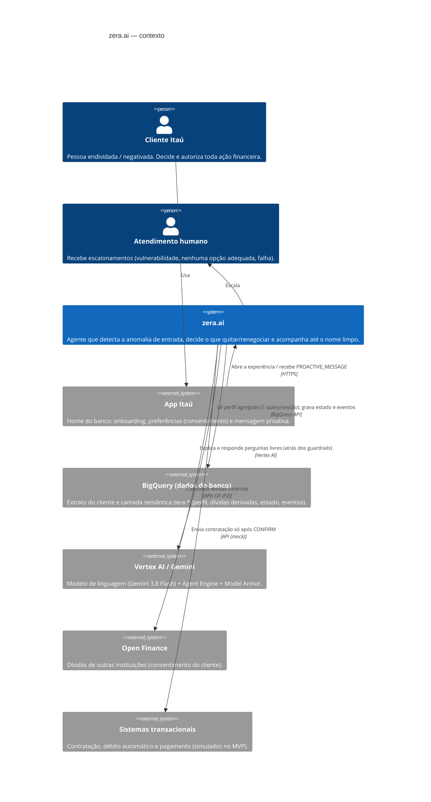
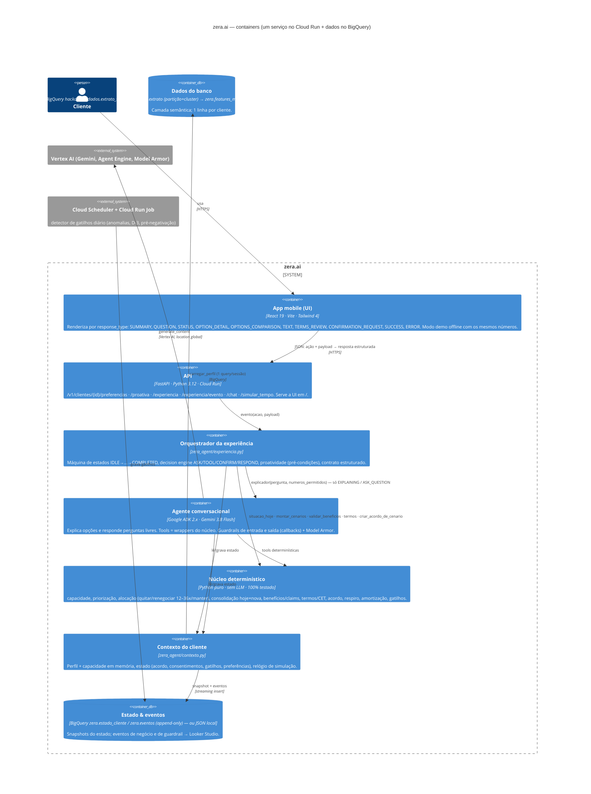
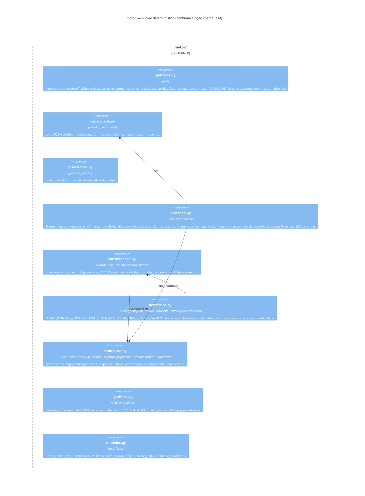
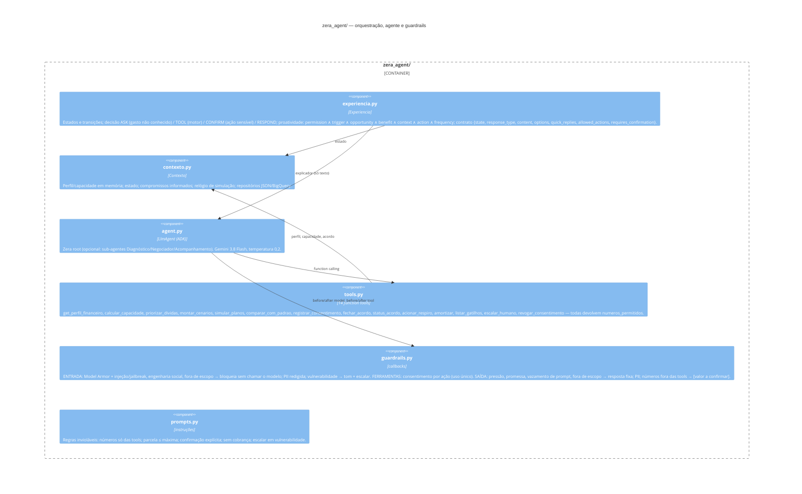

# zera.ai — Arquitetura (C4 Model)

Projeto `batalha-time-03-vhxk` · região `us-central1` (modelo via endpoint `global`) · Batalha de Agentes Itaú × Google.

Princípio que atravessa os quatro níveis: **o LLM interpreta, pergunta, explica e orquestra; todo número, elegibilidade,
comparação e contratação nasce no núcleo determinístico (`motor/`)** — spec "Agent Behavior & Content Specification v1", §3.

---

## Nível 1 — Contexto do sistema



## Nível 2 — Containers



## Nível 3 — Componentes

### 3a. Núcleo determinístico (`motor/`) — "Deterministic services" da spec



### 3b. Orquestrador da experiência + agente (`zera_agent/`)



### 3c. UI (`ui/src`)

| Componente | Responsabilidade |
|---|---|
| `api.ts` | Cliente HTTP (`/v1/clientes/{id}/…`) com fallback automático para o modo demo; `VITE_MOCK=1`, `VITE_CLIENTE_ID` |
| `mock.ts` | Mesma máquina de estados e contrato, com os números do motor (plano B offline / protótipo clicável) |
| `screens/Onboarding.tsx` | "Conheça a zera.ai" + Preferências (proactive_permission, Open Finance) → `POST /preferencias` |
| `screens/Home.tsx` | Home do banco; mostra `PROACTIVE_MESSAGE` só se a API não devolveu `silent` |
| `screens/Experiencia.tsx` | Renderer por `response_type` (10 telas do design), STATUS com checklist, input livre → `ASK_QUESTION`, badge de guardrail |
| `components/ui.tsx` | Header Itaú, tiles, toggles, cards, chips (paleta Itaú) |

## Nível 4 — Código: o contrato que amarra tudo

```text
Ação do usuário ──► POST /v1/clientes/{id}/experiencia/evento {acao, payload}
                      │
                      ▼
   Experiencia.evento()  ── decision engine ──►  ASK      → QUESTION (quick_replies / input)
                                            ├──►  TOOL     → motor.* → OPTION_DETAIL / OPTIONS_COMPARISON / TERMS_REVIEW
                                            ├──►  CONFIRM  → CONFIRMATION_REQUEST (requires_confirmation=true)
                                            ├──►  EXECUTE  → motor.criar_acordo_de_cenario → SUCCESS
                                            └──►  RESPOND  → TEXT (LLM via explicador, guardrails) / ERROR
                      │
                      ▼
   {state, response_type, content{title, description}, options[], quick_replies[], allowed_actions[],
    requires_confirmation, benefit, claims[], tradeoffs[], terms, final_terms, status{steps}, numeros_permitidos[]}
```

Regras codificadas (spec → código):

| Spec | Onde |
|---|---|
| §2 evento ≠ recomendação; §7 pré-condições de proatividade | `Experiencia.avaliar_proatividade` (`checks`) |
| §5.1 não perguntar o que já sabemos; §5.3 inferência crítica → confirmar | `_start` (renda/dívidas do extrato; pergunta única sobre gasto fora do extrato) |
| §5.2 dado financeiro só de fonte confiável | tools/experiência só leem `motor` + `Contexto` (BigQuery/CSV); prompt proíbe cálculo |
| §5.4 ação sensível → consequência + confirmação | `_confirmacao` (trade-offs, termos finais) → `_confirm` |
| §10 claims validados | `motor/beneficios.validar_beneficios` + `claims` |
| §11 recommended por critério determinístico | `motor/alocacao` (ranking) + `criterio_recomendacao` |
| §16 débito automático recalcula tudo | `termos(..., debito_automatico)` em `_confirmacao` |
| §17 só CONFIRM autoriza | `_confirm` exige `AWAITING_CONFIRMATION`; selecionar/explicar nunca cria acordo |
| §19 AT01–AT10 | `tests/test_experiencia.py` |
| Guardrails RAI (entrada → modelo → saída) | `zera_agent/guardrails.py` + `tests/test_guardrails_ataques.py` |

## Deploy e dados

- **Runtime**: um serviço Cloud Run (`infra/deploy_app.sh`): FastAPI serve a UI (`ui/dist`) e a API; ADK + Gemini via Vertex AI (`GOOGLE_CLOUD_LOCATION=global`); opcional Agent Engine (`infra/deploy_agent_engine.sh`).
- **Dados**: `docs/estrategia-dados.md` — BigQuery como única camada (Firestore não liberado): extrato clusterizado → features → `perfil_cliente` (1 query por sessão) → estado/eventos append-only.
- **Observabilidade**: eventos (`cenarios_propostos`, `opcao_selecionada`, `acordo_fechado`, `guardrail_bloqueio`, `nenhuma_opcao_adequada`, `erro_experiencia`, `proativa_enviada`) → `zera.eventos` → Looker Studio; Cloud Logging/Trace via ADK.
