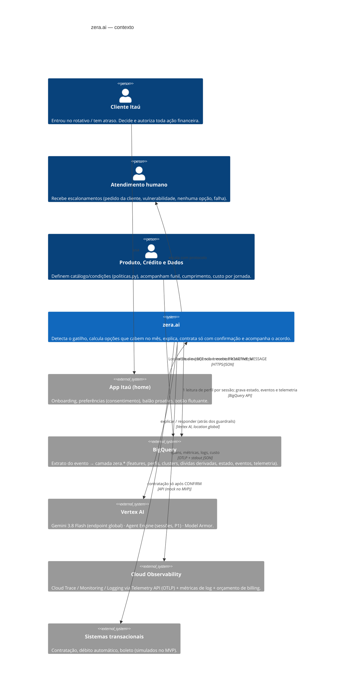
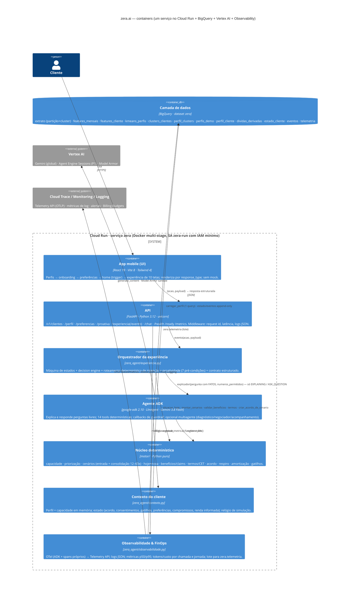
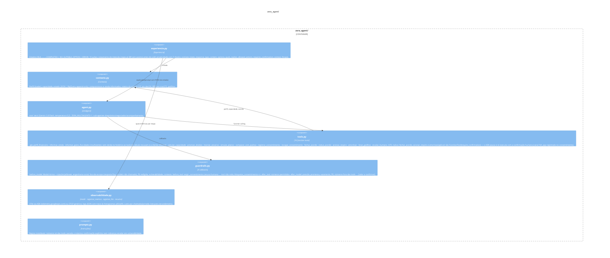
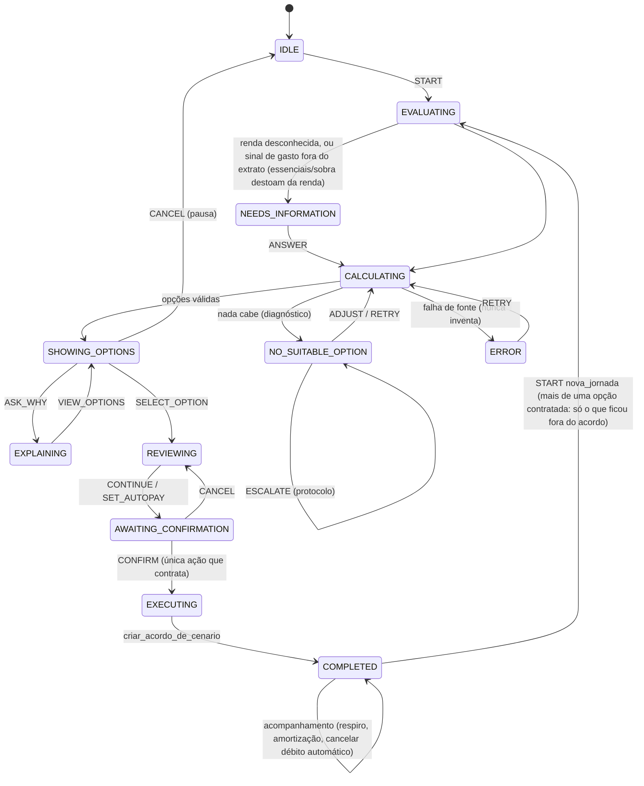
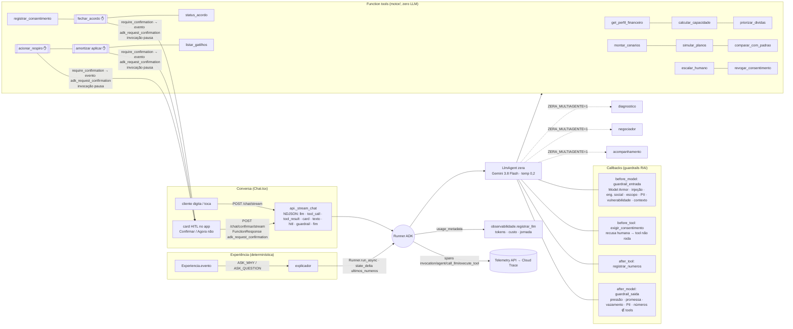
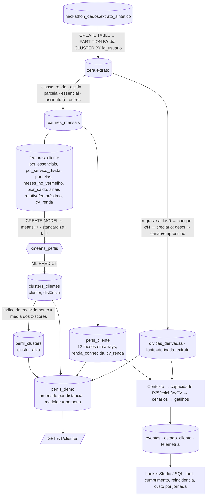

# zera.ai — Desenho de solução (C4 Model, ADK graph, dados & ciência de dados, observabilidade/FinOps, GCP)

Projeto `batalha-time-03-vhxk` · Cloud Run em `us-central1` · Gemini via endpoint `global` · BigQuery na location do dataset do evento.
Versão de trabalho para a submissão — Batalha de Agentes Itaú × Google (26–27/09/2026). Quadro de produto: `docs/quadro-produto.md` (tese, outcomes, guardrails).

## 0. Princípios que atravessam todos os níveis

| Princípio | Como aparece na arquitetura |
|---|---|
| **Núcleo determinístico manda** | Todo número, elegibilidade, comparação, termo e contratação nasce em `motor/` (Python puro, 100% testado). O LLM interpreta intenção, explica e responde — nunca calcula, nunca decide o fluxo. |
| **Ambos ganham** | O banco não abre mão do saldo devedor: muda taxa (rotativo/cheque 8–14% a.m. → 1,8% a.m.) e prazo (12–60x). Cliente: parcela menor, data para acabar, nome limpo. Banco: saldo integral + juros do acordo, em vez de dívida em atraso caminhando para provisão. |
| **Nenhum dado mockado** | Perfis vêm da base do evento (`hackathon_dados.extrato_sintetico`): cluster-alvo por k-means (BigQuery ML) ou segmentação por regras na amostra exportada. Dívidas inferidas ficam rotuladas "estimado do extrato". Renda ausente → a zera.ai pergunta. |
| **Consentimento e autonomia** | Preferências (proatividade, Open Finance), pré-condições de proatividade, só a ação `CONFIRM` contrata, pausa/recusa/escalonamento sempre disponíveis, LGPD (revogar). |
| **Guardrails RAI em três camadas** | Entrada (bloqueia sem chamar o modelo) → modelo → saída (bloqueia/redige; números conferidos com o motor) + Model Armor + consentimento por tool. |
| **Observável e com custo conhecido** | Toda etapa emite span, métrica e log estruturado; cada chamada ao Gemini registra tokens e custo; custo por jornada é uma métrica de produto. |
| **Sem beco sem saída** | Todo estado × ação tem transição definida (teste de matriz); texto livre é roteado antes do LLM; "nenhuma opção" traz diagnóstico e caminhos. |

---

## 1. Nível 1 — Contexto do sistema



## 2. Nível 2 — Containers



**Por que um serviço só**: a demo precisa de um deploy, uma URL e um custo previsível; o ADK roda embutido na API (Runner) e o
estado de conversa fica em memória (1 worker) ou no Agent Engine Sessions (`ZERA_SESSOES=vertex`) para produção com várias instâncias.

## 3. Nível 3 — Componentes

### 3a. Núcleo determinístico (`motor/`)

```mermaid
C4Component
  title motor/ — nenhuma função chama LLM; toda saída traz numeros_permitidos
  Container_Boundary(m, "motor/") {
    Component(pol, "politicas.py", "dict + carregar_politica", "Alavancas fictícias: percentil da sobra (25), colchão 5%, fator 0,75, respiros 2, taxa de renegociação 1,8% a.m., prazos 12/18/24/36/48/60, conforto 70% p/ renda irregular (CV ≥ 0,12), débito automático 2%, instituições renegociáveis.")
    Component(cap, "capacidade.py", "calcular_capacidade", "sobra[m] = renda − essenciais − compromissos; P25 − colchão → sobra segura → parcela máxima; meses fracos → respiros.")
    Component(pri, "priorizacao.py", "priorizar_dividas", "custo mensal (saldo × taxa) + peso da consequência (negativação) quando há atraso relevante.")
    Component(alo, "alocacao.py", "alocar_entrada · montar_cenarios", "Entrada: quita as mais caras que couberem, abate a mais cara restante. Um cenário por prazo: saldo consolidado integral à taxa de renegociação; viável se parcela+mantidas ≤ máxima e meses ruins ≤ respiros. Rótulos: recomendado (menor prazo com conforto), mais_barato, mais_folga, guardar_extra. Diagnóstico quando nada cabe (parcela disponível, entrada necessária).")
    Component(con, "consolidacao.py", "situacao_hoje · projecao_mesmo_prazo · resumo_cenario · termos", "Hoje sem 'total mágico': pagamentos, saldo devedor, juros/mês, sem prazo; projeção like-for-like por prazo; nova opção: total = saldo + juros; termos com CET, 1º/último vencimento, dívidas incluídas (fonte).")
    Component(ben, "beneficios.py", "validar_beneficios · claims · tradeoffs · criterio_recomendacao", "LOWER_MONTHLY_PAYMENT, LOWER_TOTAL_COST (mesmo prazo), LOWER_INTEREST_RATE, CLEAN_NAME, DEFINED_TERM, SINGLE_PAYMENT; trade-offs incluem o que o banco recebe.")
    Component(sim, "simulacao.py", "pmt · pv · cet_anual · simular_planos · criar_acordo_de_cenario · registrar_pagamento · acionar_respiro · amortizar · processar_vencimentos", "Price; acordo com componente por dívida; respiro sem mora; amortização 1:1 no componente mais pesado.")
    Component(gat, "gatilhos.py", "detectar_gatilhos", "entrada_rotativo > pre_negativacao (≥45 dias) > risco_parcela (D-3, sobra prevista < parcela) > dinheiro_extra (≥40% da renda mediana ou 13º/IRPF/FGTS/PLR).")
    Component(mod, "modelos.py", "dataclasses", "Divida (instituicao, fonte, rotativo), PerfilFinanceiro (renda_desconhecida, renda_informada, persona, fonte), Capacidade, Acordo; brl(); r2().")
  }
  Rel(alo, cap, "parcela máxima, colchão, respiros")
  Rel(alo, sim, "pmt / pv")
  Rel(con, sim, "CET, vencimentos")
  Rel(ben, con, "compara hoje × nova")
```

**Fórmulas** (todas em `motor/`, testadas em `tests/test_motor.py`):

- `parcela_maxima = 0,75 × max(0, P25(sobra) − 0,05 × renda_mediana)`; `parcela_conforto = 0,70 × parcela_maxima` se `CV(renda) ≥ 0,12`.
- `parcela(n) = Price(saldo_consolidado, 1,8%, n)`; `custo_total = entrada + n × parcela = saldo_original + juros_acordo`; `ganho_banco = juros_acordo`.
- Viável: `parcela + mantidas ≤ parcela_maxima` **e** `#meses com (sobra − colchão) < parcela ≤ respiros`.
- Hoje: `pagamento_mensal = Σ(parcela ou juros)`, `juros_mensais = Σ saldo × taxa`, `projecao(n) = Σ Price(saldo_i, taxa_i, n) × n` (comparação de custo total no mesmo prazo).
- Diagnóstico (nada cabe): `parcela_disponivel = min(parcela_maxima, (respiros+1)-ésima menor sobra líquida) − mantidas`; `entrada_necessaria = saldo − PV(parcela_disponivel, 1,8%, 60)`.

### 3b. Orquestração, agente, guardrails e observabilidade (`zera_agent/`)



### 3c. Dados (`dados/`)

| Componente | Responsabilidade |
|---|---|
| `loader.py` | `ZERA_FONTE=bigquery` → `perfil_cliente` + `dividas_derivadas` + `perfis_demo` + `clusters_clientes` (1 query); fallback extrato bruto. `amostra` → export real (`amostra_bq_extrato_sintetico.csv`, gerado por `sql/exportar_amostra.sql`) + `segmentacao.py`. `fixture` → só testes. Renda = média mensal das entradas do histórico (`renda_media`, `meses_com_renda`, `renda_fonte`); sem entradas → `renda_desconhecida` → a experiência/agente perguntam. |
| `segmentacao.py` | Mesmas features do SQL em pandas; índice de endividamento; pseudônimos determinísticos (medoide = "Cleide"). |
| `sql/zera_tabelas.sql` | extrato (partição/cluster) → features_mensais → perfil_cliente → dividas_derivadas → estado/eventos/telemetria. |
| `sql/clusterizacao.sql` | features_cliente → `CREATE MODEL kmeans_perfis` (k-means++, features padronizadas) → `ML.PREDICT` → perfil_clusters (índice) → perfis_demo. |
| `publicar_bq.py` | Cria o dataset na location do evento e roda os dois scripts (idempotente); `--imprimir` para o console. |

### 3d. API (`api/main.py`)

| Rota | Uso | LLM? |
|---|---|---|
| `GET /health` `GET /ready` `GET /metrics` | liveness · readiness (fonte responde) · métricas/FinOps | não |
| `GET /v1/clientes` · `GET /v1/clientes/{id}/perfil` | perfis do cluster-alvo · perfil financeiro com fontes e capacidade | não |
| `GET/POST /v1/clientes/{id}/preferencias` | consentimento (proatividade, Open Finance) | não |
| `GET /v1/clientes/{id}/proativa` | PROACTIVE_MESSAGE ou `{silent, checks, reason}` | não |
| `GET /v1/clientes/{id}/experiencia` · `POST …/experiencia/evento` | resposta atual · ação → resposta estruturada | só ASK_WHY/ASK_QUESTION |
| `GET /chat/inicio` | abertura determinística da conversa: contexto (gatilho, renda desconhecida, acordo ativo), 3 proteções e sugestões (direcionamento) | não |
| `POST /chat` · `POST /chat/stream` | conversa com o agente ADK; o stream é NDJSON com um evento por linha: `llm` (tokens/custo) · `tool_call` · `tool_result` · `card` (raio_x, capacidade, prioridades, cenarios, planos, acordo, amortizacao) · `texto` · `hitl` · `guardrail` · `fim` (sugestões, FinOps, acordo) | sim |
| `POST /chat/confirmar` · `POST /chat/confirmar/stream` | HITL: devolve ao ADK a decisão humana (`request_id`, `confirmed`, `frase`) como `FunctionResponse(adk_request_confirmation)` → a tool pausada executa (ou é recusada) | sim |
| `POST /simular_tempo` · `GET /gatilhos/{id}` · `POST /reset/{id}` | relógio da demo · gatilhos · reset (LGPD) | não |

### 3e. UI (`ui/src`)

| Tela | response_type / origem | Design |
|---|---|---|
| `Perfis.tsx` | `GET /v1/clientes` | lista do cluster-alvo (medoide destacado), fonte e rótulos |
| `Onboarding.tsx` | preferências → `POST /preferencias` | "Conheça a zera.ai" + toggles (proactive_permission, Open Finance) |
| `Home.tsx` | `GET /proativa` | home do Itaú, balão no botão flutuante (faísca), silêncio explicado. Balão presente → toque abre a experiência guiada; sem balão → o botão abre a conversa com o agente |
| `Experiencia.tsx` | SUMMARY · QUESTION · STATUS · OPTION_DETAIL · OPTIONS_COMPARISON · TEXT · TERMS_REVIEW · CONFIRMATION_REQUEST · SUCCESS · ERROR | 10 telas + acompanhamento do acordo + quick replies + histórico da conversa + FinOps; link "Conversar" para o chat |
| `Chat.tsx` | `GET /chat/inicio` · `POST /chat/stream` · `POST /chat/confirmar/stream` | conversa com o agente em tempo real: chips de tool (ex.: "calculando capacidade"), cards do motor (raio-X, capacidade, prioridades, cenários com "Quero esta", planos, acordo), **card HITL** ("Contratar o acordo": opção, parcela, prazo, total, saldo devedor, juros → Confirmar / Agora não), selo de guardrail, caixa de proteções, sugestões de próximo passo, chip FinOps (tokens/custo do turno) |

## 4. Nível 4 — Código: máquina de estados e contrato



Roteamento de texto livre (`_intencao`, antes do LLM): LGPD → apagar dados · pessoa/atendente → ESCALATE · agora não/depois → CANCEL (pausa) ·
número em NEEDS_INFORMATION → ANSWER · desconto/juros zero → resposta honesta (condição inexistente) · "sim" em AWAITING_CONFIRMATION → orienta o botão
(não contrata) · "sim/continuar" em REVIEWING → CONTINUE · "Nx/N meses" → seleciona ou explica prazos que cabem · "por que" → ASK_WHY · rótulo
(menor parcela…) → SELECT_OPTION · "opções/ajuda" → VIEW_OPTIONS/START · saudação → orientação · resto → LLM com FATOS do estado; se o LLM falhar → orientação com ações.

Contrato de resposta: `{state, response_type, content{title, description}, options[], quick_replies[{id,label,acao,payload,text,input}], allowed_actions[],
requires_confirmation, cta, status{steps}, current, option, benefit, claims[], tradeoffs[], terms, final_terms, diagnosis, paths[], escalation, context, jornada_id, finops, numeros_permitidos[]}`.

## 5. ADK graph (agente)



**HITL nativo do ADK (✋)**: as três tools com efeito são `FunctionTool(func, require_confirmation=True)` (`amortizar` só quando
`aplicar=True`). Quando o modelo decide chamá-las, o ADK **não executa**: emite a function call `adk_request_confirmation`
(`originalFunctionCall{id,name,args}`) e encerra a invocação. A API transforma isso no card HITL com os números do motor (cenário/plano
guardado na sessão, nunca o texto do modelo) e o app responde em `/chat/confirmar` com `FunctionResponse(id=request_id, name=
adk_request_confirmation, response={confirmed, payload{frase_cliente}})`; só então a tool roda, registrando o consentimento com
`canal=hitl_app` e a frase. Recusa → `before_tool` devolve `acao_recusada` e a tool não roda (`bloqueios_consentimento++`). Métricas:
`zera.hitl_pedido{tool}` e `zera.hitl_resposta{confirmed}`. "Sim" digitado nunca contrata — só o botão.

**Interação visível e rápida**: `/chat/stream` devolve cada evento do Runner assim que acontece — o app mostra o chip da tool
("calculando capacidade…"), o card com o resultado do motor (`state_delta.ui`), o texto final, o card HITL e o selo de guardrail, com
tokens/custo do turno. A abertura (`/chat/inicio`) é determinística (0 tokens): contexto do gatilho, as três proteções e as sugestões
de próximo passo (direcionamento do produto).

Sessões: `InMemorySessionService` (1 worker) ou `VertexAiSessionService` (Agent Engine, `ZERA_SESSOES=vertex`). Memória de longo prazo
(Agent Engine Memory Bank) é P1. O agente é o mesmo no `adk web`, no `/chat` e no explicador da experiência.

## 6. Pipeline de dados e ciência de dados



**Decisões de ciência de dados**

| Etapa | Escolha | Por quê / como validar |
|---|---|---|
| Features | 12 meses por cliente; proporções (essenciais/saídas, serviço de dívida/saídas) e sinais binários | Robustas quando a renda não aparece no extrato (base do evento pode não ter entradas). |
| Segmentação | k-means (BigQuery ML), k=4, k-means++, features padronizadas | Roda onde os dados estão, sem mover dados. Validar k com `ML.EVALUATE` (Davies-Bouldin) e estabilidade (`ML.CENTROIDS`) antes de afirmar o nº de segmentos (quadro item 05). |
| Cluster-alvo | maior índice de endividamento (média de z-scores de vermelho, pior saldo, serviço de dívida, parcelas, rotativo, empréstimo) | Regra explícita e auditável; a mesma fórmula roda em pandas no modo local (`segmentacao.py`). |
| Persona | medoide do cluster-alvo (menor distância ao centróide) recebe o nome "Cleide" | Persona = cliente real mais típico do segmento; identidade fictícia (quadro item 19). |
| Dívidas | derivadas por regras (rotuladas) — o evento não traz cadastro | Substituir por cadastro real na integração; a interface já mostra a fonte. |
| Capacidade | P25 da sobra − colchão 5% × 0,75; conforto 70% se CV(renda) ≥ 0,12 | Premissas documentadas em `politicas.py`; sensibilidade testada (gasto de R$ 80 muda a recomendação; R$ 300 → nenhuma opção). |
| Renda ausente | perguntar (informação confirmada pela cliente), nunca imputar | Quadro itens 13/14: dados insuficientes; entrada atípica ≠ renda livre. |
| Gatilhos | entrada_rotativo, pre_negativacao, risco_parcela, dinheiro_extra | P1: scheduled query diária (BigQuery Data Transfer) + Pub/Sub → serviço. |
| Avaliação do agente | golden set de perguntas (guardrails, números, tom) em `tests/`; `adk eval` / Gen AI Evaluation (P1) | Métricas do quadro (itens 21–24): cumprimento D+90, conversão, reincidência, respostas sem respaldo, bloqueios. |

## 7. Deployment

```mermaid
C4Deployment
  title zera.ai — deployment no GCP (batalha-time-03-vhxk)
  Deployment_Node(dev, "Estação / Cloud Shell", "gcloud · python · node") {
    Container(src, "Repositório", "git main", "Dockerfile multi-stage · infra/*.sh · dados/sql/*.sql")
  }
  Deployment_Node(gcp, "Google Cloud", "projeto batalha-time-03-vhxk") {
    Deployment_Node(cb, "Cloud Build", "gcloud run deploy --source") {
      Container(img, "Imagem", "Artifact Registry", "python:3.12-slim + ui/dist · usuário sem privilégio")
    }
    Deployment_Node(cr, "Cloud Run · us-central1", "min 1 / max 2 · 1 vCPU · 1 GiB · concurrency 40 · SA zera-run") {
      Container(svc, "zera", "uvicorn --workers 1", "API + agente + UI")
    }
    Deployment_Node(va, "Vertex AI · global", "") { Container(gem, "Gemini 3.8 Flash", "generate_content", "+ Model Armor template zera-guardrails") }
    Deployment_Node(bq, "BigQuery · location do evento", "") { ContainerDb(ds, "dataset zera", "tabelas + modelo k-means", "partição/cluster; estado append-only") }
    Deployment_Node(ob, "Observability", "") { Container(tel, "Telemetry API → Trace/Monitoring; Cloud Logging; Billing Budgets", "", "") }
  }
  Rel(src, img, "build")
  Rel(img, svc, "deploy (revisão com label versao=git sha)")
  Rel(svc, gem, "HTTPS", "roles/aiplatform.user")
  Rel(svc, ds, "BigQuery API", "roles/bigquery.dataEditor + jobUser")
  Rel(svc, tel, "OTLP + stdout", "roles/logging.logWriter · monitoring.metricWriter · cloudtrace.agent · telemetry.*Writer")
```

Runbook: `infra/deploy_app.sh` (build+deploy+IAM) → `curl $URL/ready` → `infra/observabilidade.sh` → rollback com
`gcloud run services update-traffic zera --to-revisions=<anterior>=100`. Falhas comuns: 404 do modelo (`GOOGLE_CLOUD_LOCATION` deve ser `global`;
`unset` no shell), `Reauthentication`/ADC ausente (só afeta o LLM), BigQuery `Not found: Dataset` (rodar `publicar_bq`), JOIN entre locations (dataset
`zera` é criado na location do evento).

## 8. Observabilidade e FinOps (em todas as camadas)

| Camada | Sinal | Onde | Como usar |
|---|---|---|---|
| HTTP | `http.latencia_ms{rota,metodo}`, `zera.http_status{rota,status}`, log `http` (request id) | Monitoring (OTel) · Logs · `/metrics` | p50/p95 por rota; alerta 5xx (`infra/observabilidade.sh`) |
| Experiência | `zera.evento{acao,estado,resultado}`, `zera.transicao{de,para}`, `zera.opcoes_apresentadas`, `zera.opcao_selecionada`, `zera.acordo_fechado`, `zera.nenhuma_opcao`, `zera.escalado`, `zera.erro`, `zera.intencao` | Monitoring · Logs (`transicao`) · `zera.eventos` | funil (item 23), taxa de "nenhuma opção", escalonamentos, intenções não cobertas |
| Motor | spans `motor.montar_cenarios`, `motor.criar_acordo` + latência | Cloud Trace · `/metrics` | custo zero de tokens; latência de cálculo (~1 ms) |
| Agente (ADK) | spans `invocation`, `agent_run`, `call_llm` (tokens), `execute_tool`; `zera.llm.*`; log `chamada_llm` | Cloud Trace · Monitoring · `zera.telemetria` | tokens, latência e custo por chamada; taxa de bloqueio dos guardrails (`zera.guardrail_bloqueio{camada,tipo}`) |
| Guardrails | evento `guardrail_bloqueio`, contadores `alucinacao_numerica`, `pii_redigida`, `bloqueios_consentimento` (session state) | `zera.eventos` · Logs | item 24: números divergentes, respostas sem respaldo, violações de tom |
| HITL (conversa) | `zera.hitl_pedido{tool}`, `zera.hitl_resposta{confirmed}`; consentimento com `canal=hitl_app` + frase no estado do cliente | Monitoring · `zera.estado_cliente` | taxa de confirmação por ação; nenhuma ação com efeito sem par pedido→resposta |
| Dados | `dados.listar_clientes.latencia_ms`, `/ready` | Monitoring | readiness real (a fonte responde) |
| FinOps | `custo_usd = tokens × preço/1M` por chamada; `custo_da_jornada(jornada_id)`; `/metrics.finops` (custo médio por acordo/jornada); orçamento de billing 50/90/100% | `/metrics` · `zera.telemetria` · Billing Budgets | custo por jornada concluída (item 25); o LLM entra em 2 das 10 telas |

Modelo de custo por jornada (referência): 0 tokens no fluxo guiado; "por que essa opção?" ≈ 1 chamada (~1,5k tokens de entrada, ~150 de saída);
cada pergunta livre ≈ 1 chamada (~1,2k/120). Com preços de referência da classe Flash (US$ 0,30/1M entrada, US$ 2,50/1M saída), uma jornada com
"por que" + 2 perguntas ≈ **US$ 0,002**. Infra: Cloud Run min 1 instância ≈ custo fixo baixo; BigQuery on-demand com partição/cluster
(1 leitura de perfil por sessão, sem varrer o extrato). Latência: eventos determinísticos < 10 ms de API; LLM 1–4 s (p95 alvo < 6 s).

## 9. Segurança e RAI

- **Entrada → modelo → saída** (workshop RAI): `guardrails.py` + Model Armor (`ZERA_MODEL_ARMOR=1`, template criado em `infra/setup_gcp.sh`). Golden set de ataques em `tests/test_guardrails_ataques.py`.
- **Consentimento**: preferências explícitas; na experiência guiada `CONFIRM` é a única ação que contrata; na conversa, as tools com efeito exigem a confirmação humana nativa do ADK (`require_confirmation` → card no app → `/chat/confirmar`), registrada com `canal=hitl_app` e a frase da cliente; "sim" digitado não contrata.
- **Dados**: contexto mínimo (agregados, nunca o extrato bruto no prompt), PII redigida na entrada e na saída, identidades fictícias, `revogar_consentimento` (LGPD), estado append-only com `apagado=true`.
- **IAM**: service account dedicada `zera-run` com papéis mínimos (Vertex user, BigQuery dataEditor/jobUser, logging/monitoring/trace writers, Model Armor user). Segredos de terceiros só no Secret Manager.
- **Runtime**: container sem privilégio, 1 worker, timeouts, CORS por env, docs desligados em produção (`ZERA_DOCS=0`).

## 10. Uso de cada serviço GCP habilitado no projeto

| Serviço (API habilitada) | Uso no zera.ai | Status |
|---|---|---|
| Vertex AI / Agent Platform (`aiplatform`) | Gemini 3.8 Flash via ADK (endpoint global); Agent Engine Sessions (`ZERA_SESSOES=vertex`) e deploy gerenciado (`infra/deploy_agent_engine.sh`); Gen AI Evaluation para o golden set | MVP (modelo) · P1 (sessões/eval) |
| BigQuery (+ Storage, Connection, Data Policy, Reservation, Data Transfer, Migration) | camada de dados completa, k-means (BigQuery ML), estado/eventos/telemetria; Data Transfer = scheduled query diária de features/clusters; Data Policy = mascaramento de colunas (P1) | MVP |
| Cloud Run | serviço único (API + agente + UI) com SA dedicada | MVP |
| Cloud Build · Artifact Registry · Container Registry | build da imagem (`gcloud run deploy --source`) | MVP |
| Cloud Logging | logs JSON estruturados com trace id; métricas de log (`infra/observabilidade.sh`) | MVP |
| Cloud Monitoring · Telemetry API | métricas OTel (`workload.googleapis.com/zera.*`) e traces do ADK via `telemetry.googleapis.com`; alerta 5xx | MVP |
| Model Armor | sanitização de prompt e resposta (template `zera-guardrails`) | MVP (flag) |
| Cloud Billing · Billing Budgets | orçamento com alertas 50/90/100% | MVP |
| Pub/Sub | P1: eventos de gatilho (scheduled query → Pub/Sub → serviço) e trilha de eventos para outros consumidores | P1 |
| Secret Manager | credenciais de integrações futuras (Open Finance, sistemas transacionais) | P1 |
| Cloud Storage | staging de deploy/Agent Engine; exportações | apoio |
| IAM · IAM Credentials · Resource Manager · Service Usage · API Keys | SA e papéis mínimos; habilitação de APIs | MVP |
| Dataform · Dataplex | P1: versionar as transformações SQL (zera_tabelas/clusterizacao) como pipeline Dataform; catálogo/linhagem no Dataplex | P1 |
| Dialogflow · Discovery Engine (Vertex AI Search) · Gemini API (generativelanguage) | não usados: a conversa é ADK + Gemini no Vertex (governança/observabilidade); Discovery Engine seria RAG de FAQ do produto (P2) | não usado (justificado) |
| Analytics Hub | não usado no MVP (compartilhamento de datasets entre times) | não usado |
| Cloud Shell | operação (publicar_bq, deploy) | apoio |

Não habilitados e por isso fora do desenho: Firestore (estado em BigQuery append-only), Cloud Scheduler (substituído por scheduled query + Pub/Sub), Cloud Trace API clássica (substituída pela Telemetry API OTLP).

## 11. Boas práticas adotadas

Determinismo testável (56 testes sem rede, matriz estado × ação); configuração 12-factor por env (`env.demo`); idempotência (SQL `CREATE OR REPLACE`/`IF NOT EXISTS`, reset por cliente, segundo `CONFIRM` não duplica acordo); contrato de API estável (UI reage a `response_type`); observabilidade como código; IAM mínimo; imagem sem root; sem dado sintético na aplicação (fixtures só em testes); documentação viva (README + este desenho + quadro de produto).

## 12. Spec → código

| Spec / quadro | Onde |
|---|---|
| §2 evento ≠ recomendação; §7 pré-condições de proatividade | `Experiencia.avaliar_proatividade` (`checks`) |
| §5.1 não perguntar o que já sabemos; §5.3 confirmar inferência crítica; item 13 dados insuficientes | `_proxima_pergunta` (renda só se ausente; gasto uma vez) |
| §5.2 dado financeiro só de fonte confiável | `Contexto` ← `dados/loader` (BigQuery/amostra) → `motor` |
| §5.4 ação sensível → consequência + confirmação; §17 só CONFIRM autoriza | `_confirmacao` → `_confirm` (estado `AWAITING_CONFIRMATION`) |
| §10 claims validados; §11 recommended explicável | `motor/beneficios` · `criterio_recomendacao` |
| §16 débito automático recalcula tudo | `termos(..., debito_automatico)` |
| item 13 exceções (recusar, pausar, atendimento, nenhuma oferta, condição inexistente) | `_cancel(texto)`, `_escalate`, `_sem_opcao`, `_condicao_inexistente`, `_pedido_de_prazo` |
| item 15 motor; item 16 papel do LLM | `motor/` · `_prompt_pergunta` (FATOS) + guardrail de números |
| item 19/20 guardrails de dados, financeiros e de experiência | `guardrails.py` · `tests/test_guardrails_ataques.py` · trade-offs antes da decisão |
| itens 21–25 métricas, monitoramento, FinOps | `observabilidade.py` · `zera.eventos` · `zera.telemetria` · `/metrics` |
| §19 AT01–AT10 | `tests/test_experiencia.py` |
